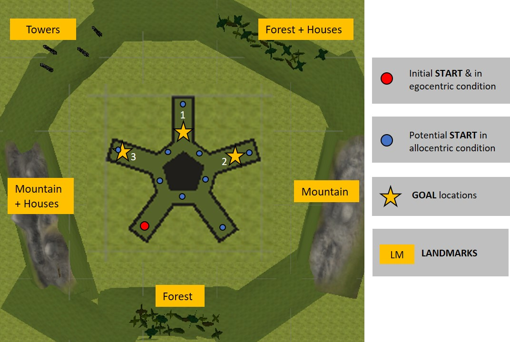
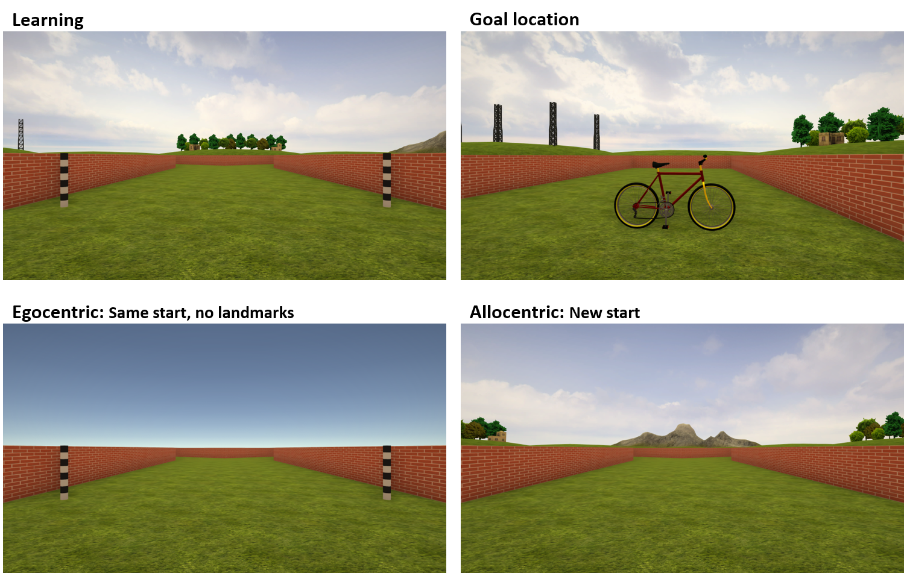
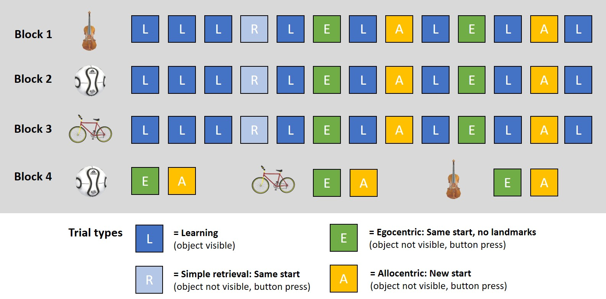
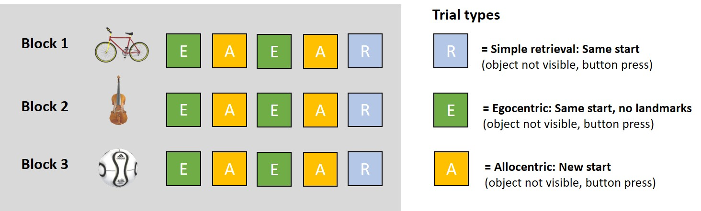
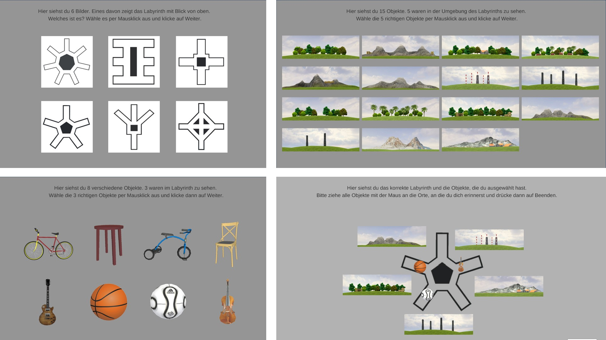
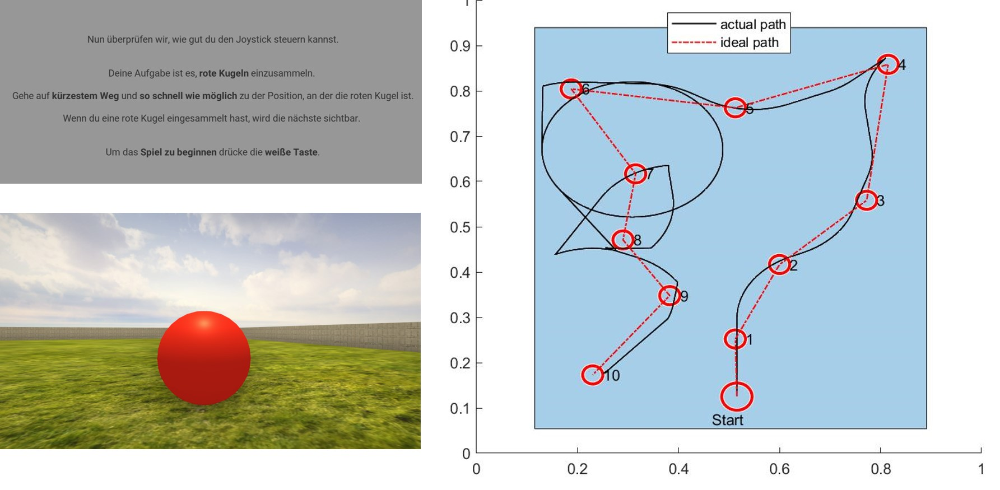

# Task

Navigating a star-shaped maze environment ("Starmaze") with three goal locations.

{width=400px}

# Sessions

*Day 2*

* Practise trials: joystick control (2 trials) and task explanation (5 trials).
* Navigation to and remembering of three goal locations. Training trials where goal is visible. Probe trials where goal is not visible with two conditions: egocentric (observer-dependent, i.e. from same starting point but without landmark cues) and allocentric (observer-independent, i.e. from new starting points) (15 trials * 3 goal locations = 45 trials).

*Day 14*

* Egocentric and allocentric probe trials (4 trials * 3 locations = 12 trials (plus 3 * simple probe trials which are not analyzed)).
* Non-navigation memory test: Recognize maze shape, recognize landmarks and goal objects, position landmarks and goal object (4 trials).

{width=500px}

{width=500px}

{width=500px}


```{r setup, include=FALSE, cache=FALSE}
knitr::read_chunk('Script_02_Analyzer.R')
knitr::opts_chunk$set(warning=FALSE, message=FALSE) 
options(knitr.kable.NA='')
```

```{r, load_analysis_packages, include=FALSE, cache=FALSE}
```

```{r, include=FALSE}
file_name <- "../WP10_data/WP10_results/wp10_navigation_data.RData"
load(file_name)
sm_orig <- sm_data 
sm_data <- sm_data %>% filter(exclude_trial_matlab==0)
rm(file_name)

demographics <- sm_orig %>% 
  filter(session==1, trial==1) %>% 
  select(id, sex, group)

n_group <- demographics %>% group_by(group) %>% count()
n_group_sex <- demographics %>% group_by(group) %>% count(sex)

n_YK <- n_group %>% filter(group=="YoungKids") %>% pull
n_YK_f <- n_group_sex %>% filter(group=="YoungKids", sex=="Female") %>% pull
n_YK_m <- n_group_sex %>% filter(group=="YoungKids", sex=="Male") %>% pull

n_OK <- n_group %>% filter(group=="OldKids") %>% pull
n_OK_f <- n_group_sex %>% filter(group=="OldKids", sex=="Female") %>% pull
n_OK_m <- n_group_sex %>% filter(group=="OldKids", sex=="Male") %>% pull

n_AD <- n_group %>% filter(group=="YoungAdults") %>% pull
n_AD_f <- n_group_sex %>% filter(group=="YoungAdults", sex=="Female") %>% pull
n_AD_m <- n_group_sex %>% filter(group=="YoungAdults", sex=="Male") %>% pull

rm(demographics, n_group, n_group_sex)
```

```{r, include=FALSE}
file_name <- "../WP10_data/WP10_results/wp10_post_nav_data.RData"
load(file_name)
rm(file_name)

n_group_post <- pt_data %>% 
  filter(trial==1) %>% 
  select(id, sex, group) %>% 
  group_by(group) %>% count()

n_YK_p <- n_group_post %>% filter(group=="YoungKids") %>% pull
n_OK_p <- n_group_post %>% filter(group=="OldKids") %>% pull
n_AD_p <- n_group_post %>% filter(group=="YoungAdults") %>% pull

rm(n_group_post)
```

```{r, data_prep, include=FALSE}
```

```{r, plot_settings, include=FALSE}
```

```{r, analysis_settings, include=FALSE}
```

```{r, papaja_output_helper, include=FALSE}
```


# Sample
Cross-sectional comparison between

* 6-8 year-old children: n = `r n_YK` (female `r n_YK_f`/ male `r n_YK_m`); non-navigational data for n = `r n_YK_p`
* 9-11 year-old children: n = `r n_OK` (female `r n_OK_f`/ male `r n_OK_m`); non-navigational data for n = `r n_OK_p`
* 18-35 year-old adults:  n = `r n_AD` (female `r n_AD_f`/ male `r n_AD_m`); non-navigational data for n = `r n_AD_p`

```{r, include=FALSE}
rm(n_YK, n_YK_f, n_YK_m, n_YK_p, n_OK, n_OK_f, n_OK_m, n_OK_p, n_AD, n_AD_f, n_AD_m, n_AD_p)
```


# Variables of interest

In training trials, the goal is visible, i.e. the trial is always completed successfully. In probe trials, the goal is not visible. Participants go to the place where they remember the goal being located and press a button. 

*Memory accuracy*: 

* **Memory score** (metric): Euclidean distance between x-/y-coordinates of the remembered and the correct goal location. Memory score normalizes the Euclidean distance value as a score from 0 to 1 (chance level 0.5) by comparing final distance to the final distance of 1000 randomly sampled locations within the maze (Jacobs 2016; Bellmund 2019)
$$\text{Euclidean distance} = \sqrt{(x_{correct}-x_{remembered})^2 + (y_{correct}-y_{remembered})^2}$$
$$\text{Memory score} = \text{percentile rank of the Euclidean distance value on random distribution}$$
* **Correct trial** (yes/no): Finding the correct goal alley, defined as the correct outer alley or intersection right in front.

*Navigation behavior*: 

* **Time**: Time to complete the trial in seconds.
* **Excess path length** (metric): This measure reflects how directly participants navigated to the remembered goal location (Suthana 2012; Jacobs 2016; Bellmund 2019). It is calculated as the travelled path length minus the ideal path length to the remembered location. The path lengths are calculated as summation of Euclidean distances between x-/y-coordinates over time. 
$$\text{(Ideal) path length} = \sum_{i=1}^{n} \sqrt{(x_{i}-x_{i+1})^2 + (y_{i}-y_{i+1})^2}$$
$$\text{Excess path length} = (path-path_{ideal})$$
* **Excess distance to goal** (metric): This measure reflects if participants searched further away from or near the correct goal location (Maei et al., 2009). It is calculated as the avg. distance to goal minus the ideal avg. distance to goal to the goal location. The distance to goal is calculated as the cumulative Euclidean distance between the the player’s x-/y-coordinates along their path and the correct goal location, averaged by the number of x-/y data points. 
$$\text{(Ideal) distance to goal} = \frac {\sum_{i=1}^{n}\sqrt{(x_{i}-x_{correct})^2 + (y_{i}-y_{correct})^2}} {n}$$
$$\text{Excess distance to goal} = (distance-distance_{ideal})$$
* **Initial rotation velocity** (metric): A modified version of the integrated absolute angular velocity (IdPhi, also called vicarious-trial-and-error (VTE) behavior, Papale et al., 2012; Santos-Pata et al., 2018; Hasz & Redish, 2020; Miles et al., 2021). This value indicates the degree of deliberation and visual exploration at the first decision point of the trial and has been associated with allocentric strategy use and spatial conflict resolution (Schmidt et al., 2013; Jeung, Iggena et al., 2023). We used the z-rotation data from the beginning of the trial up until when the participant left the first intersection. The z-rotation raw data was transformed from degrees to radians and unwrapped (to avoid circular transitions when calculating change). Then, we computed the summation of absolute change in rotation across the initial segment, divided by the number of data points to obtain velocity.
$$\text{Initial rotation Velocity} = \frac {\sum_{i=1}^{n_{initial}} | (z_{i}-z_{i+1})|} {n_{initial}}$$

{width=300px,height=500x}  

# Statistical analysis

All linear mixed models (LMM) were computed using the mixed() function from the afex package (Singmann et al., 2022), which is based on lmer() from the lme4 package (Bates et al., 2015). We used the maximum random effects structure as recommended by Barr (2013) and simplified according to Bates et al. (2015) and Matuschek et al. (2017) in case of non-convergence. 

For evaluating the general fit, we calculated a (pseudo) R^2^ for each model according to Nakagawa and Schielzeth's (2013) approach with the r2beta() function from the r2glmm package (Jaeger, 2017). However, R^2^ for LMM should be interpreted with caution and do not directly correspond to a traditional R^2^. 

We computed degrees of freedom for the LMM with Sattherthwaite's method using the lmerTest package (Kuznetsova et al., 2017; via afex package). For all significant main effects and interactions, we computed post-hoc planned contrasts with the emmeans package (Lenth, 2022), using Bonferroni-corrections for multiple comparisons.

Single-trial values were analyzed with ANOVAs from the afex package (Singmann et al., 2022). 

\newpage

# Results 

## **Raw data responses across sessions and conditions (probe trials)**

```{r, plot_raw_dots, include=F }
```

```{r,echo=F, fig.height=5, fig.cap="Responses for egocentric probe." }
dots_ego 
rm(dots_ego)
```

```{r,echo=F, fig.height=5, fig.cap="Responses for allocentric probe." }
dots_allo 
rm(dots_allo)
```

\newpage 

## Learning Session 

### **Memory score (all probe trials)**

```{r, model_probe_ms }
```

```{r, ranef_probe_ms, include=F }
```

```{r, fixef_probe_ms, include=F }
```

```{r, post_hoc_probe_ms, include=F }
```

```{r, plot_probe_ms, include=F }
```

```{r apa_probe_ms, include=F}

# model fit 
R2 <- r2beta(model.ms$full_model, method='nsj', partial=F) %>% mutate_all(apa_num)

# fixed effects 
apa_lmm.ms <- apa_print(model.ms)

# group x condition
apa_post.ms_omega_group_condition <- omega.ms %>% 
  filter(Parameter=="group:condition") %>% select(Omega2_partial) %>% apa_num()

apa_post.ms_group_condition <- post.ms_group_condition %>% apa_print() %>% bonferroni_fix()

# group 
apa_post.ms_omega_group <- omega.ms %>% 
  filter(Parameter=="group") %>% select(Omega2_partial) %>% apa_num()

apa_post.ms_group <- post.ms_group %>%  apa_print() %>% bonferroni_fix()
apa_post.ms_group_chance <- post.ms_group_chance %>%  apa_print() %>% bonferroni_fix()

# condition 
apa_post.ms_omega_condition <- omega.ms %>% 
  filter(Parameter=="condition") %>% select(Omega2_partial) %>% apa_num()

apa_post.ms_condition <- post.ms_condition %>%  apa_print()

# random effects LRT 
apa_rs.condition <- LRT.ms %>% mutate_at(vars(Chisq, Df), apa_df) %>% mutate_at(vars(p), apa_p)


rm(post.ms_group, post.ms_group_chance, post.ms_condition, LRT.ms, omega.ms)
```

(ref:p-ms-f-caption0) Fixed effects for memory score in probe.

```{r table-probe-ms-f0, echo=F}
apa_table(
  apa_lmm.ms$table, 
  caption="(ref:p-ms-f-caption0)",
  placement="h")
```

(ref:p-ms-r-caption0) Random effects for memory score in probe.

```{r table-probe-ms-r0, echo=F}
apa_random_table(VarCorr(model.ms$full_model)) %>% 
  knitr::kable(
    caption="(ref:p-ms-r-caption0)")
```

The model had a fit of $R2 = `r R2$Rsq`, [CI: `r R2$upper.CL`, `r R2$lower.CL`$].
Table\ \@ref(tab:table-probe-ms-f0)

To investigate age group and condition differences in memory accuracy during learning, we computed a LMM with the memory score. The memory score was significantly affected by *age group* (`r apa_lmm.ms$statistic$group`, $\omega^2 =$ `r apa_post.ms_omega_group`). All three groups performed significantly above chance level (test against chance level of 0.5 for 6-8-yo: `r apa_post.ms_group_chance$estimate$YoungKids`; 9-11-yo: `r apa_post.ms_group_chance$estimate$OldKids`; adults: `r apa_post.ms_group_chance$estimate$YoungAdults`) and there was a gradual increase in memory accuracy with increasing age (6-8-yo vs. 9-11-yo: `r apa_post.ms_group$statistic$YoungKids_OldKids`; 6-8-yo vs. adults: `r apa_post.ms_group$statistic$YoungKids_YoungAdults`; 9-11-yo vs. adults: `r apa_post.ms_group$statistic$OldKids_YoungAdults`). Additionally, there was a main effect of *condition* (`r apa_lmm.ms$statistic$condition`, $\omega^2 =$ `r apa_post.ms_omega_condition`), showing that memory accuracy was slightly higher in the egocentric compared to the allocentric condition. There was a trend effect for the interaction *age group x condition* (`r apa_lmm.ms$statistic$group_condition`, $\omega^2 =$ `r apa_post.ms_omega_group_condition`) and post-hoc contrasts revealed that the advantage for egocentric memory was present in 9-11-yo children (`r apa_post.ms_group_condition$statistic$OldKids_Egoret_alloret`) but not in the other age groups (6-8-yo: `r apa_post.ms_group_condition$statistic$YoungKids_Egoret_alloret`; adults: `r apa_post.ms_group_condition$statistic$YoungAdults_Egoret_alloret`). 

The LMM had a significantly better fit when including the *random slope for condition* compared to a model with random intercept only ($\chi^2$(`r apa_rs.condition$Df`) = `r apa_rs.condition$Chisq`, p `r apa_rs.condition$p`), meaning that there was substantial interindividual variation in how participants responded to the two conditions. This may explain the small effect sizes for the condition main effect and age group x condition interaction.

```{r, echo=F, fig.height=4, fig.width=4, fig.cap="Memory accuracy in learning session" }
plot.ms + 
  guides(fill=F, shape=F) & theme(legend.position="right", legend.justification="top")
```

```{r, include=F}
rm(model.ms, R2, apa_lmm.ms, apa_post.ms_group, apa_post.ms_group_chance, apa_post.ms_condition, apa_post.ms_group_condition, apa_post.ms_omega_group, apa_post.ms_omega_condition, apa_post.ms_omega_group_condition, apa_rs.condition, plot.ms)
```

\newpage

### **Latency (all probe trials)**

```{r, model_probe_time}
```

```{r, ranef_probe_time, include=F }
```

```{r, post_hoc_probe_time, include=F }
```

```{r, plot_probe_time, include=F }
```

```{r apa_probe_time, include=F}
R2 <- r2beta(model.time$full_model, method='nsj', partial=F) %>% mutate_all(apa_num)

apa_lmm.time  <- apa_print(model.time)

apa_post.time_group_condition <- post.time_group_condition %>% apa_print() %>% bonferroni_fix()

apa_rs.condition <- LRT.time %>% mutate_at(vars(Chisq, Df), apa_df) %>% mutate_at(vars(p), apa_p)

rm(post.time_group_condition, LRT.time)
```

(ref:p-t-f-caption0) Fixed effects for time in probe trials.

```{r table-probe-time-f0, echo=F}
apa_table(
  apa_lmm.time$table,
  caption="(ref:p-t-f-caption0)",
  placement="h")
```

(ref:p-t-r-caption0) Random effects for time in probe trials.

```{r table-probe-time-r0, echo=F}
apa_random_table(VarCorr(model.time$full_model)) %>% 
  knitr::kable(
    caption="(ref:p-t-r-caption0)")
```

The model had a fit of $R2 = `r R2$Rsq`, [CI: `r R2$upper.CL`, `r R2$lower.CL`$].

For time, the *group x condition* interaction was significant (`r apa_lmm.time$statistic$group_condition`; Table\ \@ref(tab:table-probe-time-f0)). Post-hoc contrasts revealed that all groups required more time to complete the allocentric condition (egocentric vs. allocentric in 6-8-yo: `r apa_post.time_group_condition$statistic$YoungKids_Egoret_alloret`; 9-11-yo: `r apa_post.time_group_condition$statistic$OldKids_Egoret_alloret`; adults: `r apa_post.time_group_condition$statistic$YoungAdults_Egoret_alloret`). 6-8-yo children required significantly more time than adults in the egocentric (`r apa_post.time_group_condition$statistic$Egoret_YoungKids_YoungAdults`) and allocentric condition (`r apa_post.time_group_condition$statistic$Alloret_YoungKids_YoungAdults`). Additionally, there was a trend for a difference between 9-11-yo children and adults in allocentric (`r apa_post.time_group_condition$statistic$Alloret_OldKids_YoungAdults`).

LRT for random slope for *condition*: Chisq(`r apa_rs.condition$Df`) = `r apa_rs.condition$Chisq`, p `r apa_rs.condition$p`

```{r table-probe-time2, echo=F}
apa_table(
  apa_post.time_group_condition$table %>% remove_rownames(),
  placement="h")
```

```{r, include=F}
rm(model.time, R2, apa_lmm.time, apa_post.time_group_condition, apa_rs.condition)
```

### **Excess path length (all probe trials)**

```{r, model_probe_path }
```

```{r, ranef_probe_path, include=F }
```

```{r, post_hoc_probe_path, include=F }
```

```{r, plot_probe_path, include=F }
```

```{r apa_probe_path, include=F}
R2 <- r2beta(model.path$full_model, method='nsj', partial=F) %>% mutate_all(apa_num)

apa_lmm.path <- apa_print(model.path)

apa_post.path_group_condition <- post.path_group_condition %>% apa_print() %>% bonferroni_fix()

apa_rs.condition <- LRT.path %>% mutate_at(vars(Chisq, Df), apa_df) %>% mutate_at(vars(p), apa_p)

rm(post.path_group_condition, LRT.path)
```

(ref:p-ep-f-caption0) Fixed effects for excess path in probe trials.

```{r table-probe-excess-path-f0, echo=F}
apa_table(
  apa_lmm.path$table,
  caption="(ref:p-ep-caption0)",
  placement="h")
```

(ref:p-ep-r-caption0) Random effects for excess path in probe trials.

```{r table-probe-excess-path-r0, echo=F}
apa_random_table(VarCorr(model.path$full_model)) %>% 
  knitr::kable(
    caption="(ref:p-ep-r-caption0)")
```

The model had a fit of $R2 = `r R2$Rsq`, [CI: `r R2$upper.CL`, `r R2$lower.CL`$].

For excess path length, the *group x condition* interaction was significant (`r apa_lmm.path$statistic$group_condition`; Table\ \@ref(tab:table-probe-excess-path-f0)). Post-hoc contrasts revealed that participants from all age groups had shorter excess path lengths in the egocentric than the allocentric condition (egocentric vs. allocentric in 6-8-yo:  `r apa_post.path_group_condition$statistic$YoungKids_Egoret_alloret`; 9-11-yo: `r apa_post.path_group_condition$statistic$OldKids_Egoret_alloret`; adults: `r apa_post.path_group_condition$statistic$YoungAdults_Egoret_alloret`). In the egocentric condition, 6-8-yo children had significantly longer excess paths than adults (`r apa_post.path_group_condition$statistic$Egoret_YoungKids_YoungAdults`), in the allocentric condition there was a gradual decrease in excess path with increasing age (6-8-yo vs. adults: `r apa_post.path_group_condition$statistic$Alloret_YoungKids_YoungAdults`; 6-8-yo vs. 9-11-yo: `r apa_post.path_group_condition$statistic$Alloret_YoungKids_OldKids`;9-11-yo vs. adults: `r apa_post.path_group_condition$statistic$Alloret_OldKids_YoungAdults`).

LRT for random slope for *condition*: Chisq(`r apa_rs.condition$Df`) = `r apa_rs.condition$Chisq`, p `r apa_rs.condition$p`

```{r table-probe-excess-path2, echo=F}
apa_table(
  apa_post.path_group_condition$table %>% remove_rownames(),
  placement="h")
```

```{r, include=F}
rm(model.path, apa_lmm.path, apa_post.path_group_condition, apa_rs.condition)
```

### **Excess distance to goal (all probe trials)**

```{r, model_probe_distance }
```

```{r, ranef_probe_distance, include=F }
```

```{r, post_hoc_probe_distance, include=F }
```

```{r, plot_probe_distance, include=F }
```

```{r apa_probe_distance, include=F}
R2 <- r2beta(model.distance$full_model, method='nsj', partial=F) %>% mutate_all(apa_num)

apa_lmm.distance <- apa_print(model.distance)

apa_post.distance_group <- post.distance_group %>% apa_print() %>% bonferroni_fix()

apa_post.distance_condition <- post.distance_condition %>% apa_print()

apa_rs.condition <- LRT.distance %>% mutate_at(vars(Chisq, Df), apa_df) %>% mutate_at(vars(p), apa_p)

rm(post.distance_group, post.distance_condition, LRT.distance)
```

(ref:p-ed-caption-f0) Fixed effects for excess distance to goal in probe trials.

```{r table-probe-excess-distance-f0, echo=F}
apa_table(
  apa_lmm.distance$table,
  caption="(ref:p-ed-caption-f0)",
  placement="h")
```

(ref:p-ed-r-caption-r0) Random effects for excess distance to goal in probe trials.

```{r table-probe-excess-distance-r0, echo=F}
apa_random_table(VarCorr(model.distance$full_model)) %>% 
  knitr::kable(
    caption="(ref:p-ed-r-caption-r0)")
```

The model had a fit of $R2 = `r R2$Rsq`, [CI: `r R2$upper.CL`, `r R2$lower.CL`$].

For excess distance to goal, we found significant main effects but no interaction (Table\ \@ref(tab:table-probe-excess-distance-f0)). There was a significant effect of *age group* (`r apa_lmm.distance$statistic$group`). Post-hoc contrasts revealed a gradual decrease in excess distance to goal with increasing age, meaning that that older participants searched in closer proximity to the actual goal locations (6-8-yo vs. 9-11-yo: `r apa_post.distance_group$statistic$YoungKids_OldKids`; 6-8-yo vs. adults: `r apa_post.distance_group$statistic$YoungKids_YoungAdults`; 9-11-yo vs. adults: `r apa_post.distance_group$statistic$OldKids_YoungAdults`). Additionally, there was a main effect of *condition* (`r apa_lmm.distance$statistic$condition`), with an increased excess distance to goal in the allocentric compared to the egocentric condition (`r apa_post.distance_condition$full_result`).

LRT for random slope for *condition*: Chisq(`r apa_rs.condition$Df`) = `r apa_rs.condition$Chisq`, p `r apa_rs.condition$p`

```{r, include=F}
rm(model.distance, apa_lmm.distance, apa_post.distance_group, apa_post.distance_condition, apa_rs.condition)
```

### **Initial rotation velocity (all probe trials)**

```{r, model_probe_rotation_velocity }
```
 
```{r, ranef_probe_rotation_velocity, include=F }
```

```{r, post_hoc_probe_rotation_velocity, include=F }
```

```{r, plot_probe_rotation_velocity, include=F }
```

```{r apa_probe_rotation_velocity, include=F }
R2 <- r2beta(model.rotation_velocity$full_model, method='nsj', partial=F) %>% mutate_all(apa_num)

apa_lmm.init_vel <- apa_print(model.rotation_velocity)

apa_post.init_vel_group_condition <- post.init_vel_group_condition %>% apa_print() %>% bonferroni_fix()

apa_rs.condition <- LRT.rotation_velocity %>% mutate_at(vars(Chisq, Df), apa_df) %>% mutate_at(vars(p), apa_p)

rm(post.init_vel_group_condition, LRT.rotation_velocity)
```

(ref:p-init-vel-f-caption0) Fixed effects for initial rotation veloctiy in probe trials.

```{r table-probe-init-vel-f0, echo=F}
apa_table(
  apa_lmm.init_vel$table,
  caption="(ref:p-init-vel-f-caption0)",
  placement="h")
```

(ref:p-init-vel-r-caption-r0) Random effects for initial rotation veloctiy in probe trials.

```{r table-probe-init-vel-r0, echo=F}
apa_random_table(VarCorr(model.rotation_velocity$full_model)) %>% 
  knitr::kable(
    caption="(ref:p-init-vel-r-caption-r0)")
```

The model had a fit of $R2 = `r R2$Rsq`, [CI: `r R2$upper.CL`, `r R2$lower.CL`$].

For the initial rotation velocity, there was a significant *group x condition* interaction (`r apa_lmm.init_vel$statistic$group_condition`; Table\ \@ref(tab:table-probe-init-vel-f0)). Post-hoc contrasts showed that significant age group differences were only present in the allocentric condition, where 6-8-yo children had a significantly lower initial rotation velocity than both 9-11-yo (`r apa_post.init_vel_group_condition$statistic$Alloret_YoungKids_OldKids`) and adults (`r apa_post.init_vel_group_condition$statistic$Alloret_YoungKids_YoungAdults`). All groups had significantly higher initial rotation velocity for the allocentric than egocentric condition (6-8-yo: `r apa_post.init_vel_group_condition$statistic$YoungKids_Egoret_alloret`; 9-11-yo: `r apa_post.init_vel_group_condition$statistic$OldKids_Egoret_alloret`; adults: `r apa_post.init_vel_group_condition$statistic$YoungAdults_Egoret_alloret`). 

LRT for random slope for *condition*: Chisq(`r apa_rs.condition$Df`) = `r apa_rs.condition$Chisq`, p `r apa_rs.condition$p`

```{r table-probe-init-vel2, echo=F}
apa_table(
  apa_post.init_vel_group_condition$table %>% remove_rownames(),
  placement="h")
```

```{r, include=F}
rm(model.rotation_velocity, apa_lmm.init_vel, apa_post.init_vel_group_condition, apa_rs.condition)
```

```{r, echo=F, fig.height=4.5, fig.width=10, fig.cap="Navigation behavior" }
plot.time + 
  plot.path + 
  plot.distance + 
  plot.rotation_velocity + 
  plot_layout(nrow=1, guides="collect") & 
  guides(fill=F, shape=F) & theme(legend.position="top", legend.justification=c(-0.025,0))

rm(plot.time, plot.path, plot.distance, plot.rotation_velocity)
```


## Consolidation 

```{r, include=F, eval=F}
OLD TEXT FOR FULL MODEL
Memory accuracy measured with the memory score was significantly affected by *age group* (`r apa_lmm.ms$statistic$group`. All three groups performed significantly above chance level (test against chance level of 0.5 for 6-8-yo: `r apa_post.ms_group_chance$statistic$YoungKids`; 9-11-yo: `r apa_post.ms_group_chance$statistic$OldKids`; adults: `r apa_post.ms_group_chance$statistic$YoungAdults`) and there was a gradual increase in memory accuracy with increasing age (6-8-yo vs. 9-11-yo: `r apa_post.ms_group$statistic$YoungKids_OldKids`; 6-8-yo vs. adults: `r apa_post.ms_group$statistic$YoungKids_YoungAdults`; 9-11-yo vs. adults: `r apa_post.ms_group$statistic$OldKids_YoungAdults`). Additionally, there was a main effect of *condition* (`r apa_lmm.ms$statistic$condition`), showing that memory accuracy was slightly higher in the egocentric compared to the allocentric condition (`r apa_post.ms_condition$estimate`), and a main effect of *session* (), revealing that memory accuracy deteriorated significantly in the 2-week time period between sessions (). There were no significant two-way or three-way interactions for the memory score (Table\ \@ref(tab:table-probe-ms-f0)), and thus, no evidence for age-related differences in forgetting across sessions, condition-related differences in forgetting across sessions, and no age-specific advantage for egocentric over allocentric spatial memory. 
```


### **Post-navigational memory tasks**

{width=500px}

```{r, model_post_layout, include=F }
```

```{r, plot_post_layout, include=F }
```

```{r, model_post_landmark, include=F }
```

```{r, plot_post_landmark, include=F }
```

```{r, model_post_position, include=F }
```

```{r, plot_post_position, include=F }
```

### **Layout**

```{r apa_layout, include=F}
apa_fisher.layout <- model.layout %>% pluck("p.value") %>% apa_p(add_equals=T)

apa_post.layout_young_vs_old <- post.layout$p.adj[1] %>% apa_p(add_equals=T)
apa_post.layout_young_vs_adult <- post.layout$p.adj[2] %>% apa_p(add_equals=T)
apa_post.layout_old_vs_adult <- post.layout$p.adj[3] %>% apa_p(add_equals=T)
rm(post.layout)
```

We found significant *age group* differences in the ability to correctly identify the geometrical maze layout (Fisher's exact test $p$ `r apa_fisher.layout`). Post-hoc contrasts showed a gradual increase in performance with increasing age (Bonferroni-adjusted pairwise Fisher tests: 6-8-yo vs. 9-11-yo: $p$ `r apa_post.layout_young_vs_old`; 6-8-yo vs. adults: $p$ `r apa_post.layout_young_vs_adult`; 9-11-yo vs. adults: $p$ `r apa_post.layout_old_vs_adult`).

```{r, include=F}
rm(model.layout, apa_fisher.layout, apa_post.layout_young_vs_old, apa_post.layout_young_vs_adult, apa_post.layout_old_vs_adult)
```

### **Landmarks**

```{r apa_landmark, include=F}
apa_aov.landmark <- apa_print(model.landmark)
```

There were no significant *age group* differences in the ability to correctly identify the landmark objects (`r apa_aov.landmark$statistic$group`). 

```{r, include=F}
rm(model.landmark, apa_aov.landmark)
```

### **Positioning**

```{r apa_position, include=F}
apa_aov.position <- apa_print(model.position)

apa_post.position <- post.position$contrasts %>% apa_print() %>% bonferroni_fix()
rm(post.position)
```

However, we did find significant *age group* differences in the ability to correctly position the landmark and goal objects in a 2D map (`r apa_aov.position$statistic$group`). Post-hoc contrasts showed that adults performed significantly better than both groups of children (6-8-yo vs. adults: `r apa_post.position$statistic$YoungKids_YoungAdults`; 9-11-yo vs. adults: `r apa_post.position$statistic$OldKids_YoungAdults`) but that the children groups did not differ (6-8-yo vs. 9-11-yo: `r apa_post.position$statistic$YoungKids_OldKids`). 

```{r, include=F}
rm(model.position, apa_aov.position, apa_post.position)
```

```{r, echo=F, fig.height=4.5, fig.width=8, fig.cap="Memory accuracy" }
(plot.layout + guides(color=F, shape=F)) + 
  (plot.landmark + guides(color=F, shape=F)) + 
  (plot.position + guides(color=F, shape=F)) + 
  plot_layout(nrow=1, width=c(0.3,0.23,0.23,0.23), guides="collect") & 
  theme(legend.position="top", legend.justification=c(-0.025,0))

rm(plot.layout, plot.landmark, plot.position)
```

\newpage 

# Supplementary material 

## Navigation behavior

### **Time (training trials)**

```{r, model_learn_time}
```

```{r, post_hoc_learn_time, include=F}
```

```{r, plot_learn_time, include=F}
```

```{r apa_learn_time, include=F}
R2 <- r2beta(model.time_learn$full_model, method='nsj', partial=F) %>% mutate_all(apa_num)

apa_lmm.learn_time <- apa_print(model.time_learn)

apa_post.learn_time_group <- post.learn_time_group %>% apa_print() %>% bonferroni_fix()

apa_post.learn_time_trial <- post.learn_time_trial %>% apa_print() %>% bonferroni_fix()

rm(post.learn_time_group, post.learn_time_trial)
```

(ref:l-t-caption-f0) Fixed effects for time in training.

```{r table-learn-time-f0, echo=F}
apa_table(
  apa_lmm.learn_time$table,
  caption="(ref:l-t-caption-f0)",
  placement="h")
```

(ref:l-t-caption-r0) Random effects for time in training.

```{r table-learn-time-r0, echo=F}
apa_random_table(VarCorr(model.time_learn$full_model)) %>% 
  knitr::kable(
    caption="(ref:l-t-caption-r0)")
```

The model had a fit of $R2 = `r R2$Rsq`, [CI: `r R2$upper.CL`, `r R2$lower.CL`$].

There was a main effect of *group* (`r apa_lmm.learn_time$statistic$group`), showing that 6-8-yo children required significantly more time than 9-11-yo children (`r apa_post.learn_time_group$statistic$YoungKids_OldKids`) and adults (`r  apa_post.learn_time_group$statistic$YoungKids_YoungAdults`). There was a main effect of *trial in block* (`r apa_lmm.learn_time$statistic$trial_in_block`). Here, time in the first trial per block was significantly higher than in all other trials. 
(Table\ \@ref(tab:table-learn-time-f0))

```{r, include=F}
rm(model.time_learn, R2, apa_lmm.learn_time, apa_post.learn_time_group, apa_post.learn_time_trial)
```

### **Excess path length (training trials)**

```{r, model_learn_path }
```

```{r, post_hoc_learn_path, include=F}
```

```{r, plot_learn_path, include=F}
```

```{r apa_learn_path, include=F}
R2 <- r2beta(model.path_learn$full_model, method='nsj', partial=F) %>% mutate_all(apa_num)

apa_lmm.learn_path <- apa_print(model.path_learn)

apa_post.learn_path_group <- post.learn_path_group %>% apa_print() %>% bonferroni_fix()

apa_post.learn_path_trial <- post.learn_path_trial %>% apa_print() %>% bonferroni_fix()

rm(post.learn_path_group, post.learn_path_trial)
```

(ref:l-ep-caption-f0) Fixed effects for excess path length in training.

```{r table-learn-excess-path-f0, echo=F}
apa_table(
  apa_lmm.learn_path$table,
  caption="(ref:l-ep-caption-f0)",
  placement="h")
```

(ref:l-ep-caption-r0) Random effects for excess path length in training.

```{r table-learn-excess-path-r0, echo=F}
apa_random_table(VarCorr(model.path_learn$full_model)) %>% 
  knitr::kable(
    caption="(ref:l-ep-caption-r0)")
```

The model had a fit of $R2 = `r R2$Rsq`, [CI: `r R2$upper.CL`, `r R2$lower.CL`$].

There was a main effect of *group* (`r apa_lmm.learn_path$statistic$group`), showing a gradual decrease in excess path length with increasing age (6-8-yo vs. 9-11-yo: `r apa_post.learn_path_group$statistic$YoungKids_OldKids`; 6-8-yo vs. adults: `r apa_post.learn_path_group$statistic$YoungKids_YoungAdults`; 9-11-yo vs. adults: `r apa_post.learn_path_group$statistic$OldKids_YoungAdults`). There was a main effect of *trial in block* (`r apa_lmm.learn_path$statistic$trial_in_block`). Here, excess path length in the first trial per block was significantly higher than in all other trials. (Table\ \@ref(tab:table-learn-excess-path-f0))

```{r, include=F}
rm(model.path_learn, R2, apa_lmm.learn_path, apa_post.learn_path_group, apa_post.learn_path_trial)
```

### **Excess distance to goal (training trials)**

```{r, model_learn_distance }
```

```{r, post_hoc_learn_distance, include=F}
```

```{r, plot_learn_distance, include=F}
```

```{r apa_learn__distance, include=F}
R2 <- r2beta(model.distance_learn$full_model, method='nsj', partial=F) %>% mutate_all(apa_num)

apa_lmm.learn_distance <- apa_print(model.distance_learn)

apa_post.learn_distance_group <- post.learn_distance_group %>% apa_print() %>% bonferroni_fix()

apa_post.learn_distance_trial <- post.learn_distance_trial %>% apa_print() %>% bonferroni_fix()

rm(post.learn_distance_group, post.learn_distance_trial)
```

(ref:l-ed-caption-f0) Fixed effects for excess distance to goal in training.

```{r table-learn-excess-distance-f0, echo=F}
apa_table(
  apa_lmm.learn_distance$table,
  caption="(ref:l-ed-caption-f0)",
  placement="h")
```

(ref:l-ed-caption-r0) Random effects for excess distance to goal in training.

```{r table-learn-excess-distance-r0, echo=F}
apa_random_table(VarCorr(model.distance_learn$full_model)) %>% 
  knitr::kable(
    caption="(ref:l-ed-caption-r0)")
```

The model had a fit of $R2 = `r R2$Rsq`, [CI: `r R2$upper.CL`, `r R2$lower.CL`$].

There was a main effect of *group* (`r apa_lmm.learn_distance$statistic$group`), showing that 6-8-yo children had a significantly higher excess distance to the goal than 9-11-yo children (`r apa_post.learn_distance_group$statistic$YoungKids_OldKids`) and adults (`r  apa_post.learn_distance_group$statistic$YoungKids_YoungAdults`). There was a main effect of *trial in block* (`r apa_lmm.learn_distance$statistic$trial_in_block`). Here, excess distance to the goal in the first trial per block was significantly higher than in all the other trials. 
(Table\ \@ref(tab:table-learn-excess-distance-f0))

```{r, include=F}
rm(model.distance_learn, R2, apa_lmm.learn_distance, apa_post.learn_distance_group, apa_post.learn_distance_trial)
```

### **Initial rotation velocity (training trials)**

```{r, model_learn_rotation_velocity }
```

```{r, post_hoc_learn_rotation_velocity, include=F}
```

```{r, plot_learn_rotation_velocity, include=F}
```

```{r apa_learn_rotation_velocity, include=F}
R2 <- r2beta(model.rotation_velocity_learn$full_model, method='nsj', partial=F) %>% mutate_all(apa_num)

apa_lmm.learn_rotation_velocity <- apa_print(model.rotation_velocity_learn)
```

(ref:l-irv-caption-f0)  Fixed effects for factor initial rotation velocity.

```{r table-learn-rotation-velocity-f0, echo=F}
apa_table(
  apa_lmm.learn_rotation_velocity$table,
  caption="(ref:l-irv-caption-f0)",
  placement="h")
```

(ref:l-irv-caption-r0) Random effects for factor initial rotation velocity

```{r table-learn-rotation-velocity-r0, echo=F}
apa_random_table(VarCorr(model.rotation_velocity_learn$full_model)) %>% 
  knitr::kable(
    caption="(ref:l-irv-caption-r0)")
```

The model had a fit of $R2 = `r R2$Rsq`, [CI: `r R2$upper.CL`, `r R2$lower.CL`$].

There were no significant main effects or interactions for rotation velocity in training. (Table\ \@ref(tab:table-learn-rotation-velocity-f0)). 


```{r, include=F}
rm(model.rotation_velocity_learn, R2, apa_lmm.learn_rotation_velocity)
```

```{r, echo=F, fig.height=6, fig.width=8, fig.cap="Navigation behavior" }
plot.time_learn + 
  plot.path_learn + 
  plot.distance_learn + 
  plot.rotation_velocity_learn + 
  plot_layout(nrow=2, guides="collect") & 
  guides(fill=F, shape=F) & theme(legend.position="top", legend.justification=c(-0.05,0))

rm(plot.time_learn, plot.path_learn,plot.distance_learn, plot.rotation_velocity_learn)
```

\newpage 

## Correlations & PLSC Analysis

TBD 

\newpage

## Motor Control Task 

{width=600px}

```{r, echo=F, fig.height=3, fig.width=6, fig.cap="Navigation behavior in practise trials." }

mc_plot <- function(data, xvar, yvar, my_colors, my_labels, y_label){
  p <- ggplot(data, aes(x=get(xvar), y=get(yvar), color=get(xvar), shape=get(xvar))) + 
    stat_summary(fun.data=mean_cl_normal, na.rm=TRUE, geom="errorbar", width=0.2, size=1.5) +
    stat_summary(fun=mean, na.rm=TRUE, geom="point", size=3) +
    scale_color_manual(values=my_colors, labels=my_labels, name=NULL) +
    scale_shape(guide="none") +
    coord_cartesian(ylim=c(0,NA)) +
    theme_bw(base_size=13) +
    theme(legend.position="top", legend.justification=c(0,0),
          legend.title=NULL, 
          panel.grid.major.x=element_blank(),
          axis.ticks.x=element_blank(),
          axis.text.x=element_blank()) +
    labs(x=NULL, y=y_label, 
         caption="mean and 95% CI")
  
  return(p)
}

mc_time <- mc_plot(practise, "group", "time", group_colors, group_labels, l_time)
mc_excess_path <- mc_plot(practise, "group", "excess_path_length", group_colors, group_labels, l_excess_path_length)
mc_rotation <- mc_plot(practise, "group", "rotation", group_colors, group_labels, l_rotation)

mc_time + mc_excess_path + 
  plot_annotation("Navigation behavior in motor control task") + 
  plot_layout(guides="collect") & theme(legend.position="top", legend.justification=c(0,0))

rm(mc_time, mc_excess_path, mc_rotation, mc_plot)
```

```{r, model_motor_control, include=F }
```

```{r apa_motor_control, include=F}
apa_aov.motor_time <- apa_print(model.motor_time)
post_aov.motor_time_group <- post.motor_time %>% apa_print() %>% bonferroni_fix()
rm(model.motor_time, post.motor_time)

apa_aov.motor_path <- apa_print(model.motor_path)
post_aov.motor_path_group <- post.motor_path %>% apa_print() %>% bonferroni_fix()
rm(model.motor_path, post.motor_path)

rm(practise)
```

There were significant *age group* differences the motor control task, aimed to assess the ability to use a joystick in the initial practise phase. Specifically, 6-8-yo children required more time to solve the task (`r apa_aov.motor_time$statistic$group`; 6-8-yo vs. 9-11-yo: `r post_aov.motor_time_group$statistic$YoungKids_OldKids`; 6-8-yo vs. adults: `r post_aov.motor_time_group$statistic$YoungKids_YoungAdults`) and had longer excess path lengths (`r apa_aov.motor_path$statistic$group`; 6-8-yo vs. 9-11-yo: `r post_aov.motor_path_group$statistic$YoungKids_OldKids`; 6-8-yo vs. adults: `r post_aov.motor_path_group$statistic$YoungKids_YoungAdults`). Thus, we computed a covariate by averaging the z-scored time and z-scored excess path length during practise and used this covariate to account for differences in joystick abilities. 

## Excluded trials 

```{r, echo=F, fig.height=3, fig.width=3, fig.cap="Overview of excluded trials." }

data_excluded <- sm_orig %>% 
  group_by(id, group) %>% 
  count(exclude_trial_matlab) %>% 
  ungroup() %>% 
  complete(exclude_trial_matlab, nesting(id, group), fill=list(n=0))

n_excluded_p <- data_excluded %>% 
  filter(exclude_trial_matlab==1) %>% 
  ungroup %>%   
  summarise(min=min(n), max=max(n), mean=mean(n), sd=sd(n)) %>% 
  mutate_all(round, 2)

n_excluded_t <- sm_orig %>% 
  count(exclude_trial_matlab)

ggplot(data_excluded %>% filter(exclude_trial_matlab==1), aes(x=n, fill=group, color=group)) + 
  geom_histogram(binwidth=1) + 
  scale_fill_manual(labels=group_labels, values=group_colors) + 
  scale_color_manual(labels=group_labels, values=group_colors_o) +
  theme_bw(base_size=13) + 
  theme(legend.position=c(0.8,0.8),
        legend.key.size=unit(0.5, 'cm')) + 
  labs(subtitle="Number of excluded trials",
       x="n trials",
       y="n participants")

rm(data_excluded)
```

How many trials were marked for exclusion?

Percentage of excluded trials among all trials: `r round((n_excluded_t %>%  filter(exclude_trial_matlab==1) %>% pull) / (n_excluded_t %>% filter(exclude_trial_matlab==0) %>% pull) * 100, 2)` % 

N per participant 
min: `r n_excluded_p %>% select(min) %>% pull`
max: `r n_excluded_p %>% select(max) %>% pull`
mean: `r n_excluded_p %>% select(mean) %>% pull`
sd: `r n_excluded_p %>% select(sd) %>% pull`
