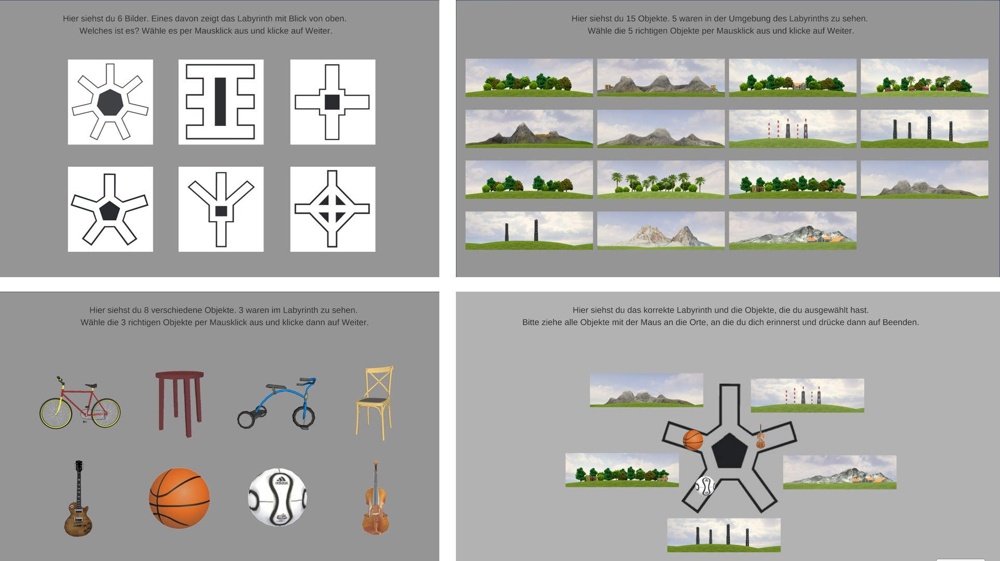

# Task

Navigating a star-shaped maze environment ("Starmaze") with three goal locations.

{width=400px}

# Sessions

*Day 2*

* Practise trials: joystick control (2 trials) and task explanation (5 trials).
* Navigation to and remembering of three goal locations. Training trials where goal is visible. Probe trials where goal is not visible with two conditions: egocentric (observer-dependent, i.e. from same starting point but without landmark cues) and allocentric (observer-independent, i.e. from new starting points) (15 trials * 3 goal locations = 45 trials).

*Day 14*

* Egocentric and allocentric probe trials (4 trials * 3 locations = 12 trials (plus 3 * simple probe trials which are not analyzed)).
* Non-navigation memory test: Recognize maze shape, recognize landmarks and goal objects, position landmarks and goal object (4 trials).

{width=500px}

{width=500px}

{width=500px}


```{r setup, include=FALSE, cache=FALSE}
knitr::read_chunk('Script_02_Analyzer.R')
knitr::opts_chunk$set(warning=FALSE, message=FALSE) 
```

```{r, load_analysis_packages, include=FALSE, cache=FALSE}
```

```{r, include=FALSE}
file_name <- "../WP10_data/WP10_results/wp10_navigation_data.RData"
load(file_name)
sm_orig <- sm_data 
sm_data <- sm_data %>% filter(exclude_trial_matlab==0)
rm(file_name)

nn_YK <- length(unique(sm_data$id[sm_data$group=="YoungKids"]))
nn_OK <- length(unique(sm_data$id[sm_data$group=="OldKids"]))
nn_AD <- length(unique(sm_data$id[sm_data$group=="YoungAdults"]))

file_name <- "../WP10_data/WP10_results/wp10_post_nav_data.RData"
load(file_name)
rm(file_name)

np_YK <- length(unique(pt_data$id[pt_data$group=="YoungKids"]))
np_OK <- length(unique(pt_data$id[pt_data$group=="OldKids"]))
np_AD <- length(unique(pt_data$id[pt_data$group=="YoungAdults"]))
```

```{r, data_prep, include=FALSE}
```

```{r, plot_settings, include=FALSE}
```

```{r, analysis_settings, include=FALSE}
```

# Sample
Cross-sectional comparison between

* Young kids (6-7 yrs, n = `r nn_YK`, non-navigational n = `r np_YK`) 
* Older kids (9-10 yrs, n = `r nn_OK`, non-navigational n = `r np_OK`)
* Young adults (18-35 yrs, n = `r nn_AD`, non-navigational n = `r np_AD`)

# Variables of interest

In training trials, the goal is visible, i.e. the trial is always completed successfully. In probe trials, the goal is not visible. Participants go to the place where they remember the goal being located and press a button. 

*Memory accuracy*: 

* **Memory score** (metric): Euclidean distance between x-/y-coordinates of the remembered and the correct goal location. Memory score normalizes the Euclidean distance value as a score from 0 to 1 (chance level 0.5) by comparing final distance to the final distance of 1000 randomly sampled locations within the maze (Jacobs 2016; Bellmund 2019)
$$\text{Euclidean distance} = \sqrt{(x_{correct}-x_{remembered})^2 + (y_{correct}-y_{remembered})^2}$$
$$\text{Memory score} = \text{percentile rank of the Euclidean distance value on random distribution}$$
* **Correct trial** (yes/no): Finding the correct goal alley, defined as the correct outer alley or intersection right in front.

*Navigation behavior*: 

* **Time**: Time to complete the trial in seconds.
* **Excess path length** (metric): This measure reflects how directly participants navigated to the remembered goal location (Suthana 2012; Jacobs 2016; Bellmund 2019). It is calculated as the travelled path length minus the ideal path length to the remembered location. The path lengths are calculated as summation of Euclidean distances between x-/y-coordinates over time. 
$$\text{(Ideal) path length} = \sum_{i=1}^{n} \sqrt{(x_{i}-x_{i+1})^2 + (y_{i}-y_{i+1})^2}$$
$$\text{Excess path length} = (path-path_{ideal})$$
* **Excess distance to goal** (metric): This measure reflects if participants searched further away from or near the correct goal location (Maei et al., 2009). It is calculated as the avg. distance to goal minus the ideal avg. distance to goal to the goal location. The distance to goal is calculated as the cumulative Euclidean distance between the the player’s x-/y-coordinates along their path and the correct goal location, averaged by the number of x-/y data points. 
$$\text{(Ideal) distance to goal} = \frac {\sum_{i=1}^{n}\sqrt{(x_{i}-x_{correct})^2 + (y_{i}-y_{correct})^2}} {n}$$
$$\text{Excess distance to goal} = (distance-distance_{ideal})$$
* **Initial rotation velocity** (metric): A modified version of the integrated absolute angular velocity (IdPhi, also called vicarious-trial-and-error (VTE) behavior, Papale et al., 2012; Santos-Pata et al., 2018; Hasz & Redish, 2020; Miles et al., 2021). This value indicates the degree of deliberation and visual exploration at the first decision point of the trial and has been associated with allocentric strategy use and spatial conflict resolution (Schmidt et al., 2013; Jeung, Iggena et al., 2023). We used the z-rotation data from the beginning of the trial up until when the participant left the first intersection. The z-rotation raw data was transformed from degrees to radians and unwrapped (to avoid circular transitions when calculating change). Then, we computed the summation of absolute change in rotation across the initial segment, divided by path length in the initial segment OR divided by the number of data point (TBD).
$$\text{Initial rotation Velocity} = \frac {\sum_{i=1}^{n_{initial}} | (z_{i}-z_{i+1})|} {n_{initial}}$$
$$\text{Initial rotation Velocity} = \frac {\sum_{i=1}^{n_{initial}} | (z_{i}-z_{i+1})|} {path_{initial}}$$

{width=300px,height=500x}  

# Statistical analysis

All linear mixed models (LMM) were computed using the mixed() function from the afex package (Singmann et al., 2022), which is based on lmer() from the lme4 package (Bates et al., 2015). The random effects structure was set up according to Bates et al. (2015) and Matuschek et al. (2017). The diagnostic plots showed non-normality, outliers and heteroscedastic variances (especially larger variance in children compared to adults). To account for this, we computed additional models 1. excluding outliers (defined as above/below the upper/lower quantile plus/minus 1.5 * IQR, similar to Bellmund et al., 2019) and 2. models with heterogeneous variances with lme() from the nlme package (Pinheiro & Bates, 2022). The results did not change substantially, which is why we decided to use the most simple LMM approach. 

For evaluating the general fit, we calculated a (pseudo) R^2^ for each model according to Nakagawa and Schielzeth's (2013) approach with the r2beta() function from the r2glmm package (Jaeger, 2017). However, R^2^ for LMM should be interpreted with caution and do not directly correspond to a traditional R^2^. We computed degrees of freedom for the LMM with Sattherthwaites method using the lmerTest package (Kuznetsova et al., 2017; via afex package). For all significant main effects and interactions, we computed post-hoc planned contrasts with the emmeans package (Lenth, 2022), using Bonferroni-corrections for multiple comparisons.

Single-trial values were analyzed with ANOVAs from the afex package (Singmann et al., 2022). 

\newpage

# Results 

## Memory accuracy: Probe trials at Day 2 & Day 14

```{r, plot_raw_dots, include=F }
```

```{r,echo=F, fig.height=5, fig.cap="Responses for egocentric probe." }
dots_ego 
rm(dots_ego)
```

```{r,echo=F, fig.height=5, fig.cap="Responses for allocentric probe." }
dots_allo 
rm(dots_allo)
```

\newpage 

### **Memory score (all probe trials)**

```{r, model_probe_ms }
```

```{r, plot_probe_ms, include=F }
```

```{r, echo=F, fig.height=5, fig.width=5, fig.cap="Memory score for probe trials." }
plot.ms
rm(plot.ms)
```

```{r apa_probe_ms, include=F}
R2 <- r2beta(model.ms$full_model, method='nsj', partial=F) %>% mutate_all(apa_num)

apa_lmm <- apa_print(model.ms)
apa_lmm <- apa_lmm$table %>% mutate(term=str_replace_all(term, c(" c| f"), ''))

emm1 <- emmeans(model.ms$full_model, pairwise ~ group, lmer.df="satterthwaite", adjust="bonferroni")$contrasts
apa_emm1 <- apa_print(emm1)
apa_emm1 <- apa_emm1$table %>% remove_rownames()
rm(emm1)

# # test against chance level 
# emm <- emmeans(model.ms, ~ group*condition*session, lmer.df="satterthwaite")
# summary(emm, null=0.5, adjust="bonferroni", infer=c(T,T))

rm(emm1)
```

The model had a fit of $R2 = `r R2$Rsq`, [CI: `r R2$upper.CL`, `r R2$lower.CL`$].

* *group* main effect: age-related differences in memory performance. 
* *session* main effect: memory accuracy declines over 2-week period.
* *condition* main effect: egocentric slightly better than allocentric. 
* no *group x condition* interaction, i.e. no age-specific condition differences.
* no *group x session* interaction, i.e. similar forgetting for all groups. 
* no *session x condition* interaction, i.e. similar forgetting for both conditions. 
(Table\ \@ref(tab:table-probe-ms0)). 

(ref:p-ms-caption0) Fixed effects for memory score in probe.

```{r table-probe-ms0, echo=F}
apa_table(
  apa_lmm,
  caption="(ref:p-ms-caption0)",
  placement="h")
```

(ref:p-ms-caption1) Post-hoc contrasts for factor group.

```{r table-probe-ms1, echo=F}
apa_table(
  apa_emm1,
  caption="(ref:p-ms-caption1)",
  placement="h")
```

```{r, include=F}
rm(model.ms, R2, apa_lmm, apa_emm1)
```

\newpage

## Memory accuracy: Non-navigational memory tasks at Day 14

{width=500px}

```{r, model_post_layout, include=F }
```

```{r, plot_post_layout, include=F }
```

```{r, model_post_landmark, include=F }
```

```{r, plot_post_landmark, include=F }
```

```{r, model_post_position, include=F }
```

```{r, plot_post_position, include=F }
```

```{r, echo=F, fig.height=5, fig.width=8, fig.cap="Scores in non-navigational memory tests." }
  plot.layout + 
  (plot.landmark + guides(color="none", shape="none")) + 
  (plot.position + guides(color="none", shape="none")) + 
  plot_annotation(title="Non-navigational memory tests") +
  plot_layout(guides="collect") & theme(legend.position="bottom", legend.justification=c(0,0))

rm(plot.layout, plot.layout_detailed, plot.landmark, plot.position)
```

### **Layout**

Significant age-related *group* differences in layout recognition.

Fisher Test for layout recognition.

```{r table-layout0, echo=F}
model.layout
```

Post-hoc contrasts for factor group.

```{r table-layout1, echo=F}
post.layout
```

### **Landmarks**

```{r apa_landmark, include=F}
apa_aov <- apa_print(model.landmark)
```

No significant age-related *group* differences in landmark recognition.  
(Table\ \@ref(tab:table-lm0)). 

(ref:lm-caption0) ANOVA for landmark recognition.

```{r table-lm0, echo=F}
apa_table(
  apa_aov,
  caption="(ref:lm-caption0)",
  placement="h")
```

```{r, include=F}
rm(model.landmark, apa_aov)
```

### **Positioning**

```{r apa_gmda, include=F}
apa_aov <- apa_print(model.position)

emm1 <- emmeans(model.position, pairwise ~ group, adjust="bonferroni")$contrasts
apa_emm1 <- apa_print(emm1)
apa_emm1 <- apa_emm1$table %>% remove_rownames()
rm(emm1)
```

Significant age-related *group* differences in positioning.  
(Table\ \@ref(tab:table-gmda0)). 

(ref:gmda-caption0) ANOVA for positioning task.

```{r table-gmda0, echo=F}
apa_table(
  apa_aov,
  caption="(ref:gmda-caption0)",
  placement="h")
```

(ref:gmda-caption1) Post-hoc contrasts for factor group.

```{r table-gmda2, echo=F}
apa_table(
  apa_emm1,
  caption="(ref:gmda-caption0)",
  placement="h")
```

```{r, include=F}
rm(model.position, apa_aov, apa_emm1)
```

\newpage 

## Navigation behaviour: Probe trials at Day 2 & Day 14

### **Time**

```{r, model_probe_time}
```

```{r, plot_probe_time, include=F }
```

```{r, echo=F, fig.height=5, fig.width=5, fig.cap="Time in probe trials." }
plot.time
rm(plot.time)
```

```{r apa_probe_time, include=F}
R2 <- r2beta(model.time$full_model, method='nsj', partial=F) %>% mutate_all(apa_num)

apa_lmm <- apa_print(model.time)
apa_lmm <- apa_lmm$table %>% mutate(term=str_replace_all(term, c(" c| f"), ''))

emm1 <- emmeans(model.time, ~ group*session, lmer.df="satterthwaite")
con1 <- summary(rbind(pairs(emm1, simple="group"), pairs(emm1, simple="session"), pairs(emm1, interaction="pairwise")), 
                infer=c(T,T), by=NULL, adjust="bonferroni")
apa_emm1 <- apa_print(con1)
apa_emm1 <- apa_emm1$table %>% remove_rownames()
rm(emm1, con1)

emm2 <- emmeans(model.time, ~ group*condition, lmer.df="satterthwaite")
con2 <- summary(rbind(pairs(emm2, simple="group"), pairs(emm2, simple="condition")), infer=c(T,T), by=NULL, adjust="bonferroni")
apa_emm2 <- apa_print(con2)
apa_emm2 <- apa_emm2$table %>% remove_rownames()
rm(emm2, con2)

emm3 <- emmeans(model.time, ~ session*condition, lmer.df="satterthwaite")
con3 <- summary(rbind(pairs(emm3, simple="session"), pairs(emm3, simple="condition"), pairs(emm3, interaction="pairwise")), 
                infer=c(T,T), by=NULL, adjust="bonferroni")
apa_emm3 <- apa_print(con3)
apa_emm3 <- apa_emm3$table %>% remove_rownames()
rm(emm3, con3)
```

The model had a fit of $R2 = `r R2$Rsq`, [CI: `r R2$upper.CL`, `r R2$lower.CL`$].

* *group x session* interaction: for all groups no significant change of time across sessions (slopes not different from zero); the slopes differed only between 6-7-year-old children (numerical decrease across sessions) and adults (numerical increase across sessions). 
* *group x condition* interaction: all groups required more time for allocentric compared to egocentric trials; in allocentric trials 6-7-year-old children required significantly more time than young adults, in egocentric trials there were no significant group differences. 
* *session x condition* interaction: for both conditions no significant change of time across sessions (slopes not different from zero); the slopes differed between egocentric (numerical decrease across sessions) and allocentric (numerical increase across sessions).
(Table\ \@ref(tab:table-probe-time0)).

(ref:p-t-caption0) Fixed effects for time in probe trials.

```{r table-probe-time0, echo=F}
apa_table(
  apa_lmm,
  caption="(ref:p-t-caption0)",
  placement="h")
```

(ref:p-t-caption1) Post-hoc contrasts for group x session interaction.

```{r table-probe-time1, echo=F}
apa_table(
  apa_emm1,
  caption="(ref:p-t-caption1)",
  placement="h")
```

(ref:p-t-caption2) Post-hoc contrasts for group x condition interaction.

```{r table-probe-time2, echo=F}
apa_table(
  apa_emm2,
  caption="(ref:p-t-caption2)",
  placement="h")
```

(ref:p-t-caption3) Post-hoc contrasts for session x condition interaction.

```{r table-probe-time3, echo=F}
apa_table(
  apa_emm3,
  caption="(ref:p-t-caption3)",
  placement="h")
```

```{r, include=F}
rm(model.time, apa_lmm, apa_emm1, apa_emm2, apa_emm3)
```

\newpage 

### **Excess path length**

```{r, model_probe_path }
```

```{r, plot_probe_path, include=F }
```

```{r, echo=F, fig.height=5, fig.width=5, fig.cap="Excess path in probe trials." }
plot.path
rm(plot.path)
```

```{r apa_probe_path, include=F}
R2 <- r2beta(model.path$full_model, method='nsj', partial=F) %>% mutate_all(apa_num)

apa_lmm <- apa_print(model.path)
apa_lmm <- apa_lmm$table %>% mutate(term=str_replace_all(term, c(" c| f"), ''))

emm1 <- emmeans(model.path, ~ group * session, lmer.df="satterthwaite")
con1 <- summary(rbind(pairs(emm1, simple="group"), pairs(emm1, simple="session"), pairs(emm1, interaction="pairwise")), 
                infer=c(T,T), by=NULL, adjust="bonferroni")
apa_emm1 <- apa_print(con1)
apa_emm1 <- apa_emm1$table %>% remove_rownames()
rm(emm1, con1)

emm2 <- emmeans(model.path, ~ group * condition, lmer.df="satterthwaite")
con2 <- summary(rbind(pairs(emm2, simple="group"), pairs(emm2, simple="condition")), infer=c(T,T), by=NULL, adjust="bonferroni")
apa_emm2 <- apa_print(con2)
apa_emm2 <- apa_emm2$table %>% remove_rownames()
rm(emm2, con2)

emm3 <- emmeans(model.path, ~ session * condition, lmer.df="satterthwaite")
con3 <- summary(rbind(pairs(emm3, simple="session"), pairs(emm3, simple="condition"), pairs(emm3, interaction="pairwise")), 
                infer=c(T,T), by=NULL, adjust="bonferroni")
apa_emm3 <- apa_print(con3)
apa_emm3 <- apa_emm3$table %>% remove_rownames()
rm(emm3, con3)
```

The model had a fit of $R2 = `r R2$Rsq`, [CI: `r R2$upper.CL`, `r R2$lower.CL`$].

* *group x session* interaction: for all groups no significant change of time across sessions (slopes not different from zero); the slopes differed only between 6-7-year-old children (numerical decrease across sessions) and both 9-10-year-old children and adults (numerical increase across sessions).
* *group x condition* interaction: all groups had longer excess paths in allocentric compared to egocentric trials; in allocentric trials both groups of children had significantly longer excess paths than young adults, in egocentric trials only 6-7-year-old children had longer excess paths than young adults. 
* *session x condition* interaction: only for allocentric condition significant change (increase) in excess path length across sessions, but not in egocentric; the slopes differed between egocentric (numerical decrease across sessions) and allocentric (increase across sessions).
(Table\ \@ref(tab:table-probe-excess-path0)). 

(ref:p-ep-caption0) Fixed effects for excess path in probe trials.

```{r table-probe-excess-path0, echo=F}
apa_table(
  apa_lmm,
  caption="(ref:p-ep-caption0)",
  placement="h")
```

(ref:p-ep-caption1) Post-hoc contrasts for group x session interaction.

```{r table-probe-excess-path1, echo=F}
apa_table(
  apa_emm1,
  caption="(ref:p-ep-caption1)",
  placement="h")
```

(ref:p-ep-caption2) Post-hoc contrasts for group x condition interaction.

```{r table-probe-excess-path2, echo=F}
apa_table(
  apa_emm2,
  caption="(ref:p-ep-caption2)",
  placement="h")
```

(ref:p-ep-caption3) Post-hoc contrasts for session x condition interaction.

```{r table-probe-excess-path3, echo=F}
apa_table(
  apa_emm3,
  caption="(ref:p-ep-caption3)",
  placement="h")
```

```{r, include=F}
rm(model.path, apa_lmm, apa_emm1, apa_emm2, apa_emm3)
```

\newpage 

### **Excess distance to goal**

```{r, model_probe_target_distance }
```

```{r, plot_probe_target_distance, include=F }
```

```{r, echo=F, fig.height=5, fig.width=5, fig.cap="Excess path in probe trials." }
plot.target_distance
rm(plot.target_distance)
```

```{r apa_probe_target_distance, include=F}
R2 <- r2beta(model.target_distance$full_model, method='nsj', partial=F) %>% mutate_all(apa_num)

apa_lmm <- apa_print(model.target_distance)
apa_lmm <- apa_lmm$table %>% mutate(term=str_replace_all(term, c(" c| f"), ''))

con1 <- emmeans(model.target_distance, pairwise ~ group, lmer.df="satterthwaite", adjust="bonferroni")$contrasts
apa_emm1 <- apa_print(con1)
apa_emm1 <- apa_emm1$table %>% remove_rownames()
rm(con1)

con2 <- emmeans(model.target_distance, pairwise ~ condition, lmer.df="satterthwaite")$contrasts
apa_emm2 <- apa_print(con2)
apa_emm2 <- apa_emm2$table %>% remove_rownames()
rm(con2)

con3 <- emmeans(model.target_distance, pairwise ~ session, lmer.df="satterthwaite")$contrasts
apa_emm3 <- apa_print(con3)
apa_emm3 <- apa_emm3$table %>% remove_rownames()
rm(con13)
```

The model had a fit of $R2 = `r R2$Rsq`, [CI: `r R2$upper.CL`, `r R2$lower.CL`$].

* *group* main effect: Younger participants navigate further away from the correct goal location. 
* *condition* main effect: In allocentric, participants navigate further away from the from the correct goal location than in egocentric.  
* *session* main effect: In session 2, participants navigate further away from the from the correct goal location than in session 1
(Table\ \@ref(tab:table-probe-excess-distance0)). 

(ref:p-ed-caption0) Fixed effects for excess distance to goal in probe trials.

```{r table-probe-excess-distance0, echo=F}
apa_table(
  apa_lmm,
  caption="(ref:p-ed-caption0)",
  placement="h")
```

(ref:p-ed-caption1) Post-hoc contrasts for factor group.

```{r table-probe-excess-distance1, echo=F}
apa_table(
  apa_emm1,
  caption="(ref:p-ed-caption1)",
  placement="h")
```

(ref:p-ed-caption2) Post-hoc contrasts for factor condition.

```{r table-probe-excess-distance2, echo=F}
apa_table(
  apa_emm2,
  caption="(ref:p-ed-caption2)",
  placement="h")
```

(ref:p-ed-caption3) Post-hoc contrasts for factor session. 

```{r table-probe-excess-distance3, echo=F}
apa_table(
  apa_emm3,
  caption="(ref:p-ed-caption3)",
  placement="h")
```

```{r, include=F}
rm(model.target_distance, apa_lmm, apa_emm1, apa_emm2, apa_emm3)
```

\newpage 

### **Initial rotation velocity**

```{r, model_probe_rotation_velocity }
```

```{r, plot_probe_rotation_velocity, include=F }
```

```{r, echo=F, fig.height=5, fig.width=5, fig.cap="Excess path in probe trials." }
plot.rotation_velocity
rm(plot.rotation_velocity)
```

```{r apa_probe_rotation_velocity, include=F }
R2 <- r2beta(model.rotation_velocity$full_model, method='nsj', partial=F) %>% mutate_all(apa_num)

apa_lmm <- apa_print(model.rotation_velocity)
apa_lmm <- apa_lmm$table %>% mutate(term=str_replace_all(term, c(" c| f"), ''))

emm2 <- emmeans(model.rotation_velocity, ~ group * condition, lmer.df="satterthwaite")
con2 <- summary(rbind(pairs(emm2, simple="group"), pairs(emm2, simple="condition")), infer=c(T,T), by=NULL, adjust="bonferroni")
apa_emm2 <- apa_print(con2)
apa_emm2 <- apa_emm2$table %>% remove_rownames()
rm(emm2, con2)

emm3 <- emmeans(model.rotation_velocity, ~ session * condition, lmer.df="satterthwaite")
con3 <- summary(rbind(pairs(emm3, simple="session"), pairs(emm3, simple="condition"), pairs(emm3, interaction="pairwise")), 
                infer=c(T,T), by=NULL, adjust="bonferroni")
apa_emm3 <- apa_print(con3)
apa_emm3 <- apa_emm3$table %>% remove_rownames()
rm(emm3, con3)
```

The model had a fit of $R2 = `r R2$Rsq`, [CI: `r R2$upper.CL`, `r R2$lower.CL`$].

* *group x condition* interaction:  
* *session x condition* interaction:

(Table\ \@ref(tab:table-probe-init-rot-vel0)). 

(ref:p-irv-caption0) Fixed effects for initial rotation veloctiy in probe trials.

```{r table-probe-init-rot-vel0, echo=F}
apa_table(
  apa_lmm,
  caption="(ref:p-irv-caption0)",
  placement="h")
```

(ref:p-irv-caption2) Post-hoc contrasts for group x condition interaction.

```{r table-probe-init-rot-vel2, echo=F}
apa_table(
  apa_emm2,
  caption="(ref:p-irv-caption2)",
  placement="h")
```

(ref:p-irv-caption3) Post-hoc contrasts for session x condition interaction.

```{r table-probe-init-rot-vel3, echo=F}
apa_table(
  apa_emm3,
  caption="(ref:p-irv-caption3)",
  placement="h")
```

```{r, include=F}
rm(model.rotation_velocity, apa_lmm, apa_emm2, apa_emm3)
```

\newpage 

### **Initial rotation by path length**

```{r, model_probe_rotation_path}
```

```{r, plot_probe_rotation_path, include=F }
```

```{r, echo=F, fig.height=5, fig.width=5, fig.cap="Normalized rotation in probe trials." }
plot.rotation_path
rm(plot.rotation_path)
```

```{r apa_probe_rotation_path, include=F}
R2 <- r2beta(model.rotation_path$full_model, method='nsj', partial=F) %>% mutate_all(apa_num)

apa_lmm <- apa_print(model.rotation_path)
apa_lmm <- apa_lmm$table %>% mutate(term=str_replace_all(term, c(" c| f"), ''))

emm2 <- emmeans(model.rotation_path, ~ group * condition, lmer.df="satterthwaite")
con2 <- summary(rbind(pairs(emm2, simple="group"), pairs(emm2, simple="condition")), infer=c(T,T), by=NULL, adjust="bonferroni")
apa_emm2 <- apa_print(con2)
apa_emm2 <- apa_emm2$table %>% remove_rownames()
rm(emm2, con2)

emm3 <- emmeans(model.rotation_path, ~ session * condition, lmer.df="satterthwaite")
con3 <- summary(rbind(pairs(emm3, simple="session"), pairs(emm3, simple="condition"), pairs(emm3, interaction="pairwise")), 
                infer=c(T,T), by=NULL, adjust="bonferroni")
apa_emm3 <- apa_print(con3)
apa_emm3 <- apa_emm3$table %>% remove_rownames()
rm(emm3, con3)
```

The model had a fit of $R2 = `r R2$Rsq`, [CI: `r R2$upper.CL`, `r R2$lower.CL`$].

* *group x condition* interaction: 
* *session x condition* interaction: 

(ref:p-irp-caption0) Fixed effects for initial rotation by path length in probe trials.

```{r table-probe-rot-p0, echo=F}
apa_table(
  apa_lmm,
  caption="(ref:p-irp-caption0)",
  placement="h")
```

(ref:p-irp-caption2) Post-hoc contrasts for group x condition interaction.

```{r table-probe-rot-p2, echo=F}
apa_table(
  apa_emm2,
  caption="(ref:p-irp-caption2)",
  placement="h")
```

(ref:p-irp-caption3) Post-hoc contrasts for session x condition interaction.

```{r table-probe-rot-p3, echo=F}
apa_table(
  apa_emm3,
  caption="(ref:p-irp-caption3)",
  placement="h")
```

```{r, include=F}
rm(model.rotation_path, apa_lmm, apa_emm2, apa_emm3)
```

\newpage 

## Supplementary material 

### Navigation behavior: Training trials at Day 2 

#### **Time**

```{r, model_learn_time}
```

```{r, plot_learn_time, include=F}
```

```{r, echo=F, fig.height=4, fig.width=5, fig.cap="Trial curve for time in training." }
plot.time_learn 
rm(plot.time_learn)
```

```{r apa_learn_time, include=F}
R2 <- r2beta(model.time_learn$full_model, method='nsj', partial=F) %>% mutate_all(apa_num)

apa_lmm <- apa_print(model.time_learn)
apa_lmm <- apa_lmm$table %>% mutate(term=str_replace_all(term, c(" c| f"), ''))

emm <- emmeans(model.time_learn, pairwise ~ group, lmer.df="satterthwaite", adjust="bonferroni")$contrasts
apa_emm <- apa_print(emm) 
apa_emm <- apa_emm$table %>% remove_rownames()
```

The model had a fit of $R2 = `r R2$Rsq`, [CI: `r R2$upper.CL`, `r R2$lower.CL`$].

The time per trial decreased across trials (main effect *trial in block*) but there were no group differences in the slope of the decrease (no interaction *group x trial in block interaction*). The groups differed in time per trial (main effect *group*). More specifically 6-7-year-old children were slower than 9-10-year-old children and adults, there were no differences between 9-10-year-old children and adults.
(Table\ \@ref(tab:table-learn-time0))

(ref:l-t-caption0) Fixed effects for time in training.

```{r table-learn-time0, echo=F}
apa_table(
  apa_lmm,
  caption="(ref:l-t-caption0)",
  placement="h")
# `r apa_lm$statistic$group`
```

(ref:l-t-caption1) Post-hoc contrasts for factor group.

```{r table-learn-time1, echo=F}
apa_table(
  apa_emm,
  caption="(ref:l-t-caption1)",
  placement="h")
```

```{r, include=F}
rm(model.time_learn, R2, apa_lmm, apa_emm, emm)
```

\newpage

#### **Excess path length**

```{r, model_learn_path }
```

```{r, plot_learn_path, include=F}
```

```{r, echo=F, fig.height=4, fig.width=5, fig.cap="Trial curve for excess path in training." }
plot.path_learn
rm(plot.path_learn)
```

```{r apa_learn_path, include=F}
R2 <- r2beta(model.path_learn$full_model, method='nsj', partial=F) %>% mutate_all(apa_num)

apa_lmm <- apa_print(model.path_learn)
apa_lmm <- apa_lmm$table %>% mutate(term=str_replace_all(term, c(" c| f"), ''))

emm <- emmeans(model.path_learn, pairwise ~ group, lmer.df="satterthwaite", adjust="bonferroni")$contrasts
apa_emm <- apa_print(emm) 
apa_emm <- apa_emm$table %>% remove_rownames()
```

The model had a fit of $R2 = `r R2$Rsq`, [CI: `r R2$upper.CL`, `r R2$lower.CL`$].

The excess path length decreased across trials (main effect *trial in block*) but there were no group differences in the slope of the decrease (no interaction *group x trial in block* ). The groups differed in excess path length (main effect *group*). More specifically younger participants had longer excess paths, meaning they took less direct routes, compare to older participants (all groups differed from each other). 
(Table\ \@ref(tab:table-learn-excess-path0))

(ref:l-ep-caption0) Fixed effects for excess path length in training.

```{r table-learn-excess-path0, echo=F}
apa_table(
  apa_lmm,
  caption="(ref:l-ep-caption0)",
  placement="h")
```

(ref:l-ep-caption1) Post-hoc contrasts for factor group.

```{r table-learn-excess-path1, echo=F}
apa_table(
  apa_emm,
  caption="(ref:l-ep-caption1)",
  placement="h")
```

```{r, include=F}
rm(model.path_learn, R2, apa_lmm, apa_emm, emm)
```

\newpage

#### **Excess distance to goal**

```{r, model_learn_target_distance }
```

```{r, plot_learn_target_distance, include=F}
```

```{r, echo=F, fig.height=4, fig.width=5, fig.cap="Trial curve for excess path in training." }
plot.target_distance_learn
rm(plot.target_distance_learn)
```

```{r apa_learn_target_distance, include=F}
R2 <- r2beta(model.target_distance_learn$full_model, method='nsj', partial=F) %>% mutate_all(apa_num)

apa_lmm <- apa_print(model.target_distance_learn)
apa_lmm <- apa_lmm$table %>% mutate(term=str_replace_all(term, c(" c| f"), ''))

emm <- emmeans(model.target_distance_learn, pairwise ~ group, lmer.df="satterthwaite", adjust="bonferroni")$contrasts
apa_emm <- apa_print(emm) 
apa_emm <- apa_emm$table %>% remove_rownames()
```

The model had a fit of $R2 = `r R2$Rsq`, [CI: `r R2$upper.CL`, `r R2$lower.CL`$].

The excess distance to goal decreased across trials (main effect *trial in block*) but there were no group differences in the slope of the decrease (no interaction *group x trial in block* ). The groups differed in excess distance to goal length (main effect *group*). More specifically 6-7 year-old children had higher excess avg. distance to goal than the other two groups, meaning they navigated further away from the correct goal location during the course of the trial.
(Table\ \@ref(tab:table-learn-excess-distance0))

(ref:l-ed-caption0) Fixed effects for excess distance to goal in training.

```{r table-learn-excess-distance0, echo=F}
apa_table(
  apa_lmm,
  caption="(ref:l-ed-caption0)",
  placement="h")
```

(ref:l-ed-caption1) Post-hoc contrasts for factor group.

```{r table-learn-excess-distance1, echo=F}
apa_table(
  apa_emm,
  caption="(ref:l-ed-caption1)",
  placement="h")
```

```{r, include=F}
rm(model.target_distance_learn, R2, apa_lmm, apa_emm, emm)
```

\newpage

#### **Initial rotation velocity**

```{r, model_learn_rotation_velocity }
```

```{r, plot_learn_rotation_velocity, include=F}
```

```{r, echo=F, fig.height=4, fig.width=5, fig.cap="Trial curve for excess path in training." }
plot.rotation_velocity_learn
rm(plot.rotation_velocity_learn)
```

```{r apa_learn_rotation_velocity, include=F}
R2 <- r2beta(model.rotation_velocity_learn$full_model, method='nsj', partial=F) %>% mutate_all(apa_num)

apa_lmm <- apa_print(model.rotation_velocity_learn)
apa_lmm <- apa_lmm$table %>% mutate(term=str_replace_all(term, c(" c| f"), ''))

```

The model had a fit of $R2 = `r R2$Rsq`, [CI: `r R2$upper.CL`, `r R2$lower.CL`$].
(Table\ \@ref(tab:table-learn-init-rot-vel0))

(ref:l-irv-caption0)  Fixed effects for factor initial rotation velocity. 

```{r table-learn-init-rot-vel0, echo=F}
apa_table(
  apa_lmm,
  caption="(ref:l-irv-caption0)",
  placement="h")
```

```{r, include=F}
rm(model.rotation_velocity_learn, R2, apa_lmm)
```

\newpage

#### **Initial rotation by path length**

```{r, model_learn_rotation_path }
```

```{r, plot_learn_rotation_path, include=F}
```

```{r, echo=F, fig.height=4, fig.width=5, fig.cap="Trial curve for normalized rotation in training." }
plot.rotation_path_learn 
rm(plot.rotation_path_learn)
```

```{r apa_learn_rotation_path, include=F}
R2 <- r2beta(model.rotation_path_learn$full_model, method='nsj', partial=F) %>% mutate_all(apa_num)

apa_lmm <- apa_print(model.rotation_path_learn)
apa_lmm <- apa_lmm$table %>% mutate(term=str_replace_all(term, c(" c| f"), ''))

# TBD 
```

The model had a fit of $R2 = `r R2$Rsq`, [CI: `r R2$upper.CL`, `r R2$lower.CL`$].
(Table\ \@ref(tab:table-learn-init-rot-p0))

ref:l-irp-caption0) Fixed effects for initial rotation by path length in training.

```{r table-learn-rot-p0, echo=F}
apa_table(
  apa_lmm,
  caption="(ref:l-irp-caption0)",
  placement="h")
```

```{r, include=F}
rm(model.rotation_path_learn, R2, apa_lmm, apa_emm, emm)
```

\newpage 

### Correlations 

TBD 

\newpage

### PLSC Analysis 

TBD, siehe Powerpoint Iryna 

\newpage

### Motor Control Task 

{width=600px}

```{r, echo=F, fig.height=3, fig.width=6, fig.cap="Navigation behavior in practise trials." }

mc_plot <- function(data, xvar, yvar, my_colors, my_labels, y_label){
  p <- ggplot(data, aes(x=get(xvar), y=get(yvar), color=get(xvar), shape=get(xvar))) + 
    stat_summary(fun.data=mean_cl_normal, na.rm=TRUE, geom="errorbar", width=0.2, size=1.5) +
    stat_summary(fun=mean, na.rm=TRUE, geom="point", size=3) +
    scale_color_manual(values=my_colors, labels=my_labels, name=NULL) +
    scale_shape(guide="none") +
    coord_cartesian(ylim=c(0,NA)) +
    theme_bw(base_size=15) +
    theme(legend.position="top", legend.justification=c(0,0),
          legend.title=NULL, 
          panel.grid.major.x=element_blank(),
          axis.ticks.x=element_blank(),
          axis.text.x=element_blank()) +
    labs(x=NULL, y=y_label, 
         caption="mean and 95% CI")
  
  return(p)
}

mc_time <- mc_plot(practise, "group", "time", group_colors, group_labels, l_time)
mc_excess_path <- mc_plot(practise, "group", "excess_path_length", group_colors, group_labels, l_excess_path_length)
mc_rotation <- mc_plot(practise, "group", "rotation", group_colors, group_labels, l_rotation)

mc_time + mc_excess_path + mc_rotation + 
  plot_annotation("Navigation behavior in motor control task") + 
  plot_layout(guides="collect") & theme(legend.position="top", legend.justification=c(0,0))

rm(mc_time, mc_excess_path, mc_rotation, mc_plot, practise)
```

### Excluded trials 

```{r, echo=F, fig.height=3, fig.width=3, fig.cap="Overview of excluded trials." }

excluded_trials <- sm_orig %>% 
  group_by(id, group) %>% 
  tally(exclude_trial_matlab)

ggplot(excluded_trials, aes(x=n, fill=group, color=group)) + 
  geom_histogram(binwidth=1) + 
  scale_fill_manual(labels=group_labels, values=group_colors) + 
  scale_color_manual(labels=group_labels, values=group_colors_o) +
  theme_bw(base_size=15) + 
  theme(legend.position=c(0.8,0.8),
        legend.key.size=unit(0.5, 'cm')) + 
  labs(subtitle="Number of excluded trials",
       x="n trials",
       y="n participants")

rm(excluded_trials)
```