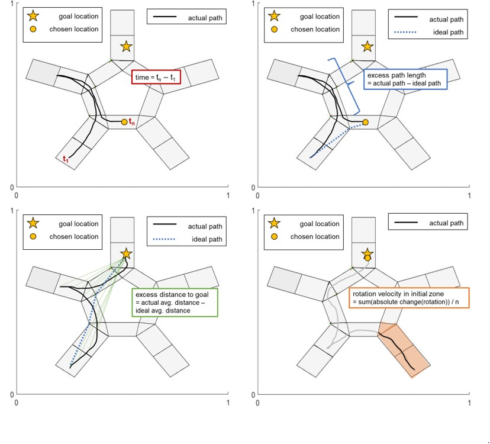
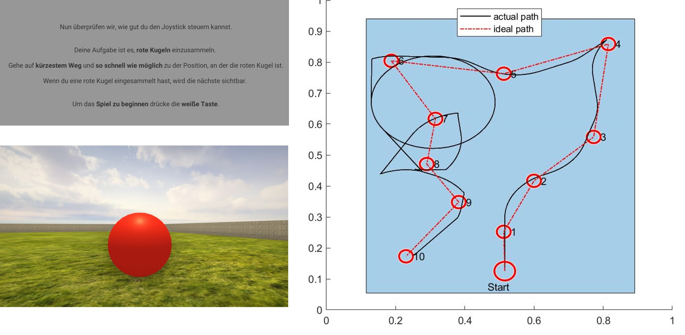

### Task

Navigating a star-shaped maze environment ("Starmaze") with three goal locations.

{width=400px}

### Sessions

*Day 2*

* Practise trials, including joystick control practise (2 trials) and task explanation (5 trials).
* Navigation to and remembering of three goal locations. Baseline retrieval in egocentric (observer-dependent, i.e. from same starting point but without landmark cues) and allocentric (observer-independent, i.e. from new starting points) condition (15 trials * 3 goal locations = 45 trials).

*Day 14*

* Retrieval in egocentric and allocentric condition (5 trials * 3 locations = 15 trials).
* Post-navigation memory test: Recognize maze shape, recognize landmarks and goal objects, reconstruct location of landmarks and goal object (4 trials).

{width=500px}

{width=500px}

{width=500px}


```{r setup, include = FALSE, cache=FALSE}

library(tidyverse)
library(patchwork)
library(kableExtra)
# install.packages('tinytex')
# tinytex::install_tinytex() # latex for pdf file creation

#knitr::read_chunk('Script_03_Plot_Creator.R')
#knitr::read_chunk('Script_02_Analyzer.Rmd')
```


```{r, load_data, include=FALSE}
file_name <- "../WP10_data/WP10_results/wp10_navigation_data.RData"
load(file_name)
sm_orig <- sm_data 
sm_data <- sm_data %>% filter(exclude_trial_matlab==0)
rm(file_name)

file_name <- "../WP10_data/WP10_results/wp10_post_nav_data.RData"
load(file_name)
rm(file_name)
```


### Current sample
Cross-sectional comparison between

* Young kids (6-7 yrs, n = `r length(unique(sm_data$id[sm_data$group=="YoungKids"]))`) 
* Older kids (9-10 yrs, n = `r length(unique(sm_data$id[sm_data$group=="OldKids"]))`)
* Young adults (18-35 yrs, n = `r length(unique(sm_data$id[sm_data$group=="YoungAdults"]))`)


### How long did the sessions take on average?

```{r, session_duration, include=FALSE}
t1 <- sm_data %>% group_by(session, group) %>%
  summarize(mean=mean(duration, na.rm = T))

t2 <- pt_data %>% group_by(group) %>%
  summarize(mean=mean(duration, na.rm = T))
```

```{r, temp}
# *Young kids*: 
# 
# * Day 1: `r round(t1$mean[t1$session==3 & t1$group=="YoungKids"])` min for practise, `r round(t1$mean[t1$session==1 & t1$group=="YoungKids"])` min for learning
# * Day 13: `r round(t1$mean[t1$session==2 & t1$group=="YoungKids"])` min for retrieval, `r round(t2$mean[t2$group=="YoungKids"])` min for non-navigational tests
# 
# *Older kids*: 
# 
# * Day 1: `r round(t1$mean[t1$session==3 & t1$group=="OldKids"])` min for practise, `r round(t1$mean[t1$session==1 & t1$group=="OldKids"])` min for learning
# * Day 13: `r round(t1$mean[t1$session==2 & t1$group=="OldKids"])` min for retrieval, `r round(t2$mean[t2$group=="OldKids"])` min for non-navigational tests
```

\newpage 

### Variables of interest

In learning trials, the goal is visible, i.e. the trial is always completed successfully except if the participant needs more than 120 seconds (time out). In egocentric and allocentric retrieval trials, the goal is not visible. Participants go to the place where they remember the goal being located and press a button. 

* **Correct goal alley** (yes/no): Finding the correct goal alley (outer arm + intersection). 
* **Final distance** (metric): Distance between x-/y-coordinates of the chosen and the correct goal location. 
$$\text{Final distance} = \sqrt{(x_{correct}-x_{chosen})^2 + (y_{correct}-y_{chosen})^2}$$
* **Time**: Time to complete trial in seconds.
* **Path length (error)** (metric): Absolute deviation of travelled path length in relation to ideal path length. Calculated as summation of distance between x-/y-coordinates over time, then deviation of actual compared to ideal value (Caution: value can be misleading if chosen location is not correct location).
$$\text{Path length} = \sum \sqrt{(x_{t}-x_{t+1})^2 + (y_{t}-y_{t+1})^2}$$
$$\text{Path length error} = (path-path_{ideal})/path_{ideal}$$
* **Distance to location (error)** (metric): Absolute deviation of the cumulative distance to a location (e.g. goal, egocentric location) in relation to the ideal cumulative distance to the location (on the shortest possible path). Calculated as summation of distance between the player's x-/y-coordinates and the location's x-/y-coordinates, then averaged by the number of x-/y data points. 
$$\text{Distance to goal} = \frac {\sum \sqrt{(x_{t}-x_{goal})^2 + (y_{t}-y_{goal})^2}} {n_{t}}$$
$$\text{Distance to goal error} = (distance-distance_{ideal})/distance_{ideal}$$
* **Rotation** (turns normalized by path length): Sum of z-rotations over time divided by 360° (i.e. full turns) and divided by path length (reason: longer paths automatically involve more rotation in a Starmaze environment, therefore normalized rotation is more indicative of exploration/looking-around). 
* **Strategy classification**: Classification into three strategies: Direct to chosen goal, detour (entering more zones than necessary), or reorientation (re-entering same zones). 

{width=300px,height=500x}


``` {r, plot_settings, include=FALSE}
```

``` {r, func_mean, include=FALSE}
```

\newpage

### Memory encoding: Learning curves at Day 1

How well did participants learn the position of the three goal locations at Day 2?  


\newpage 

### Immediate (Day ) vs. consolidated retrieval (Day 13): Egocentric and allocentric condition 


### Strategy use data 

I categorized participant's trajectories into strategies. Strategies are a qualitative description of the trajectory and independent of performance. For example, direct strategy means that the participant went straight to the chosen goal location without any detours or reorienting, independent of whether the chosen goal location was correct or incorrect. 

*Criteria for strategy assignment*:

* **Direct**: Shortest path to chosen goal location without re-entry of zones. Not necessarily correct goal location. 
* **Detour**: Non-direct path without re-entry of zones to chosen goal location. 
* **Reoriented**: Non-direct path with re-entry of zones to chosen goal location. 

{width=300px}
`
\newpage 

### Correlations 


\newpage

### Non-navigational memory tasks

{width=500px}

\newpage 

### Motor Control Task 

{width=600px}

