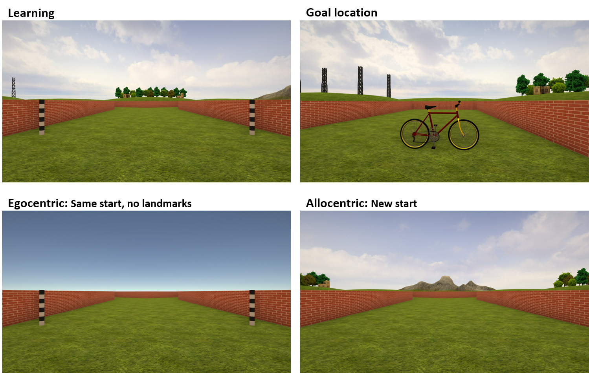

## Task

Navigating a star-shaped maze environment ("Starmaze") with three goal locations.

{width=400px}

## Sessions

*Day 2*

* Practise trials, including joystick control practise (2 trials) and task explanation (5 trials).
* Navigation to and remembering of three goal locations. Baseline retrieval in egocentric (observer-dependent, i.e. from same starting point but without landmark cues) and allocentric (observer-independent, i.e. from new starting points) condition (15 trials * 3 goal locations = 45 trials).

*Day 14*

* Retrieval in egocentric and allocentric condition (5 trials * 3 locations = 15 trials).
* Post-navigation memory test: Recognize maze shape, recognize landmarks and goal objects, reconstruct location of landmarks and goal object (4 trials).

{width=500px}

{width=500px}

{width=500px}


```{r setup, include=FALSE, cache=FALSE}

library(tidyverse)
library(patchwork)
library(ggrepel)
# install.packages('tinytex')
# tinytex::install_tinytex() # latex for pdf file creation

knitr::read_chunk('Script_03_Plot_Creator.R')
knitr::read_chunk('Script_02_Analyzer.R')
```

```{r, analysis_packages_and_sum_coding, include=FALSE, cache=FALSE}
```

```{r, include=FALSE}
file_name <- "../WP10_data/WP10_results/wp10_navigation_data.RData"
load(file_name)
sm_orig <- sm_data 
sm_data <- sm_data %>% filter(exclude_trial_matlab==0)
rm(file_name)

file_name <- "../WP10_data/WP10_results/wp10_post_nav_data.RData"
load(file_name)
rm(file_name)
```

```{r, analysis_data, include=FALSE}
```

```{r, contrast_matrices, include=FALSE}
```

## Current sample
Cross-sectional comparison between

* Young kids (6-7 yrs, n = `r length(unique(sm_data$id[sm_data$group=="YoungKids"]))`) 
* Older kids (9-10 yrs, n = `r length(unique(sm_data$id[sm_data$group=="OldKids"]))`)
* Young adults (18-35 yrs, n = `r length(unique(sm_data$id[sm_data$group=="YoungAdults"]))`)


## Variables of interest

In learning trials, the goal is visible, i.e. the trial is always completed successfully except if the participant needs more than 120 seconds (time out). In egocentric and allocentric retrieval trials, the goal is not visible. Participants go to the place where they remember the goal being located and press a button. 

* **Correct goal alley** (yes/no): Finding the correct goal alley (x-/y-coordinates in correct outer arm or intersection right in front). 
* **Final distance & memory score** (metric): Final distance between x-/y-coordinates of the chosen and the correct goal location. Memory score normalizes the final distance value as a score from 0 to 1 (chance = 0.5) by comparing final distance to the final distance to 1000 randomly sampled locations.  
$$\text{Final distance} = \sqrt{(x_{correct}-x_{chosen})^2 + (y_{correct}-y_{chosen})^2}$$
$$\text{Memory score} = 1 - \text{percentage of random final distance values that are smaller than final distance}$$
* **Time**: Time to complete trial in seconds.
* **Excess path length** (metric): Subtraction of ideal path length (to chosen location) from traveled path length. Traveled path length is calculated as summation of distance between x-/y-coordinates over time.
$$\text{Path length} = \sum \sqrt{(x_{t}-x_{t+1})^2 + (y_{t}-y_{t+1})^2}$$
$$\text{Excess path length} = (path-path_{ideal})$$
* **Distance to location (error)** (metric): Absolute deviation of the cumulative distance to a location (e.g. goal, egocentric location) in relation to the ideal cumulative distance to the location (on the shortest possible path). Calculated as summation of distance between the player's x-/y-coordinates and the location's x-/y-coordinates, then averaged by the number of x-/y data points. 
$$\text{Distance to goal} = \frac {\sum \sqrt{(x_{t}-x_{goal})^2 + (y_{t}-y_{goal})^2}} {n_{t}}$$
$$\text{Distance to goal error} = \frac {(distance-distance_{ideal})} {distance_{ideal}}$$
* **Rotation** (turns normalized by path length): Sum of absolute z-rotations over time (takes into account switch at 0/360°) divided by 360° (i.e. full turns) and divided by path length (reason: longer paths automatically involve more rotation in a Starmaze environment, therefore normalized rotation is more indicative of exploration/looking-around). 
$$\text{Rotation} = \frac {\sum |(z_{t}-z_{t+1})|} {path} * \frac {1} {360} $$
* **Strategy classification**: Classification into three strategies: Direct to chosen goal, detour (entering more zones than necessary), or reorientation (re-entering same zones). 

{width=300px,height=500x}


``` {r, plot_settings, include=FALSE}
```

``` {r, plot_functions, include=FALSE}
```

\newpage

## Memory encoding: Learning curves at Day 1

```{r, plots_learning_trialwise, include=F }
```

```{r, warning=F, echo=F }

line_t + plot_spacer() + line_dg + line_rpl + line_r +
  plot_annotation("Navigation behaviour in learning trials (goal visible)") + 
  plot_layout(guides="collect") & theme(legend.position="top", legend.justification=c(0,0))

rm(line_t, line_plex, line_dg, line_rpl, line_r, sm_trialwise)
```
 
### **Time**

```{r, stats_learning_time }
```

### **Excess path length**

```{r, stats_learning_plex }
```

### **Distance to goal**

```{r, stats_learning_dg }
```

### **Rotation (by path length)**

```{r, stats_learning_rpl }
```

### **Rotation**

```{r, stats_learning_r }
```

\newpage 

## Immediate (Day 1) vs. consolidated retrieval (Day 13): Egocentric and allocentric condition 

```{r, plots_aggregated, include=F }
```

```{r, plots_aggregated_change, include=F }
```

```{r, plots_probe_locations, include=F }
```

### Accuracy 

**Raw data**

```{r, warning=F, echo=F, fig.height=5 }

dots_ego 

rm(dots_ego)
```

```{r, warning=F, echo=F, fig.height=5 }

dots_allo 

rm(dots_allo)
```

\newpage 

**Correct final alley**

```{r, warning=F, echo=F }

box_ego_cfa + labs(subtitle="Egocentric") + box_allo_cfa + labs(subtitle="Allocentric") +
  plot_annotation("Accuracy in probe trials") + 
  plot_layout(guides="collect") & theme(legend.position="bottom", legend.justification=c(0,0))

rm(box_ego_cfa, box_allo_cfa)
```

```{r, stats_probe_acc }
```

```{r, warning=F, echo=F }

box_ego_delta_cfa + labs(subtitle="Egocentric") + box_allo_delta_cfa + labs(subtitle="Allocentric")  +
  plot_annotation("Change in accuracy in probe trials") + 
  plot_layout(guides="collect") & theme(legend.position="bottom", legend.justification=c(0,0))

rm(box_ego_delta_cfa, box_allo_delta_cfa)
```

```{r, stats_probe_acc_change }
```

\newpage 

**Memory score (all trials)**

```{r, warning=F, echo=F }

box_ego_ms + labs(subtitle="Egocentric") + box_allo_ms + labs(subtitle="Allocentric") +
  plot_annotation("Memory score in all probe trials") + 
  plot_layout(guides="collect") & theme(legend.position="bottom", legend.justification=c(0,0))

rm(box_ego_ms, box_allo_ms)
```

```{r, stats_probe_ms }
```

```{r, warning=F, echo=F }

box_ego_delta_ms + labs(subtitle="Egocentric") + box_allo_delta_ms + labs(subtitle="Allocentric")  +
  plot_annotation("Change in memory score in probe trials") + 
  plot_layout(guides="collect") & theme(legend.position="bottom", legend.justification=c(0,0))

rm(box_ego_delta_ms, box_allo_delta_ms)
```

```{r, stats_probe_ms_change }
```

\newpage 

**Memory score (correct trials)**

```{r, warning=F, echo=F }

box_ego_cor_ms + labs(subtitle="Egocentric") + box_allo_cor_ms + labs(subtitle="Allocentric") +
  plot_annotation("Memory score in all correct probe trials (spatial precision)") + 
  plot_layout(guides="collect") & theme(legend.position="bottom", legend.justification=c(0,0))

rm(box_ego_cor_ms, box_allo_cor_ms)
```

```{r, stats_probe_ms_in_corr }
```

\newpage

**Egocentric goal alley (in allocentric probe trials with outer starts only)**

```{r, warning=F, echo=F }

box_allo_efa + labs(subtitle="Allocentric") + box_allo_incor_efa + box_allo_mse + box_allo_incor_mse + 
  plot_annotation("Egocentric response in (all/only correct) allocentric probe trials") + 
  plot_layout(guides="collect") & theme(legend.position="bottom", legend.justification=c(0,0))

rm(box_allo_efa, sm_agg2, sm_agg3)
```

```{r, stats_probe_ego_acc}
```

```{r, stats_probe_ms_ego_in_allo }
```

\newpage 


### Navigation behaviour: metric variables

**Time**

```{r, warning=F, echo=F }

box_ego_t + labs(subtitle="Egocentric") + box_allo_t + labs(subtitle="Allocentric") +
  plot_annotation("Time in probe trials") + 
  plot_layout(guides="collect") & theme(legend.position="bottom", legend.justification=c(0,0))

rm(box_ego_t, box_allo_t)
```

```{r, stats_probe_time}
```

\newpage 

**Excess path length**

```{r, warning=F, echo=F }

box_ego_cplex + labs(subtitle="Egocentric") + box_allo_cplex + labs(subtitle="Allocentric") +
  plot_annotation("Excess path length in probe trials") + 
  plot_layout(guides="collect") & theme(legend.position="bottom", legend.justification=c(0,0))

rm(box_ego_cplex, box_allo_cplex)
```

```{r, stats_probe_chplex }
```

\newpage 

**Distance to goal & distance to ego** 

```{r, warning=F, echo=F }

box_ego_dg + labs(subtitle="Egocentric")  + 
  box_allo_dg + labs(subtitle="Allocentric") + 
  box_allo_deg + labs(subtitle="Allocentric") + 
  plot_annotation("Distance to goal & distance to ego in probe trials") + 
  plot_layout(guides="collect") & theme(legend.position="bottom", legend.justification=c(0,0))

rm(box_ego_dg, box_allo_dg, box_allo_deg)
```

```{r, stats_probe_dg}
```

```{r, stats_probe_dg_ego_in_allo}
```

\newpage 

**Distance to chosen goal** 

```{r, warning=F, echo=F }

box_ego_dgch + labs(subtitle="Egocentric")  + 
  box_allo_dgch + labs(subtitle="Allocentric") + 
  plot_annotation("Distance to chosen goal") + 
  plot_layout(guides="collect") & theme(legend.position="bottom", legend.justification=c(0,0))

rm(box_ego_dge, box_allo_dge, box_allo_dege)
```

```{r, stats_probe_chdg}
```

\newpage 

**Rotation and rotation by path length**

```{r, warning=F, echo=F }

box_ego_r + labs(subtitle="Egocentric") + box_allo_r + labs(subtitle="Allocentric") +
  plot_annotation("Rotation (full turns) in probe trials") + 
  plot_layout(guides="collect") & theme(legend.position="bottom", legend.justification=c(0,0))

rm(box_ego_r, box_allo_r)
```

```{r, warning=F, echo=F }

box_ego_rpl + labs(subtitle="Egocentric") + box_allo_rpl + labs(subtitle="Allocentric") +
  plot_annotation("Relative rotation (full turns, normalized by path length) in probe trials") + 
  plot_layout(guides="collect") & theme(legend.position="bottom", legend.justification=c(0,0))

rm(box_ego_rpl, box_allo_rpl)
rm(list=ls(pattern="agg"), sm_change)
```

```{r, stats_probe_rpl}
```

\newpage 

### Navigation behaviour: strategy use data 

```{r, plots_probe_strategy, include=F }
```

Strategies are a qualitative description of the trajector, independent of accuracy. For example, direct strategy means that the participant went straight to the chosen goal location without any detours or reorienting, independent of whether the chosen goal location was correct or incorrect. 

*Criteria for strategy assignment*:

* **Direct**: Shortest path to chosen goal location without re-entry of zones. Not necessarily correct goal location. 
* **Detour**: Non-direct path without re-entry of zones to chosen goal location. 
* **Reoriented**: Non-direct path with re-entry of zones to chosen goal location. 

{width=300px}

```{r, warning=F, echo=F }

bar_ego_strategy + labs(subtitle="Egocentric") + bar_allo_strategy + labs(subtitle="Allocentric") +
  plot_annotation("Search strategy") + 
  plot_layout(guides="collect") & theme(legend.position="bottom", legend.justification=c(0,0))

rm(bar_ego_strategy, bar_allo_strategy, sm_strategy)
```

\newpage 

## Correlations 

*TBD*

\newpage

## Post-navigational memory tasks

{width=500px}

```{r, plots_post_tests, include=F }
```

```{r, warning=F, echo=F }

layout + landmark_avg + gmda_avg + 
  plot_annotation("Post-navigational memory tests") + 
  plot_layout(width=c(0.4, 0.2, 0.2), guides="collect") & theme(legend.position="bottom", legend.justification=c(0,0))

rm(layout, layout_avg, landmark_details, landmark_avg, gmda_avg)
```

### **Layout**

```{r, stats_layout }
```

### **Landmarks**
```{r, stats_landmark }
```

### **Positioning**
```{r, stats_gmda }
```

\newpage 

## Motor Control Task 

{width=600px}

``` {r, plots_motor_control, include=FALSE}
```

```{r, warning=F, echo=F }

#mc_t + mc_pl + mc_v + mc_r +
mc_t + mc_v + mc_r +
  plot_annotation("Motor control practise task") +
  plot_layout(guides="collect") & theme(legend.position="bottom", legend.justification=c(0,0))

```

## Excluded trials 

``` {r, plots_excluded, include=FALSE}
```

```{r, warning=F, echo=F }

ex1 + ex2 +
  plot_annotation("Overview of excluded trial data") + 
  plot_layout(guides="collect") & theme(legend.position="bottom", legend.justification=c(0,0))

```

