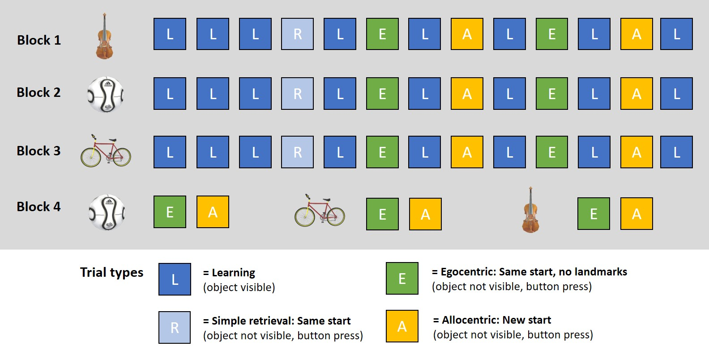

### Task

Navigating a star-shaped maze environment ("Starmaze") with three goal locations.

{width=450px}

### Time points of testing

**Day 1**

* Practise trials, including motor control (joystick) and task explanation (5 trials).
* Navigation to and remembering the position of three goal locations. Baseline retrieval in egocentric (observer-dependent, i.e. from same starting point but without landmark cues) and allocentric (observer-independent, i.e. from new starting points) navigation condition (45 trials).

**Day 14**

* Consolidated retrieval in egocentric and allocentric navigation condition (15 trials).
* Non-navigational memory retrieval: Recognitve maze shape, recognize landmarks and goal objects, reconstruct location of landmarks and goal object (4 trials).


{width=500px}

{width=500px}

{width=500px}


```{r setup, include = FALSE, cache=FALSE}
library(tidyverse)
library(cowplot)
library(kableExtra)
source("R_rainclouds.R")

knitr::read_chunk('Script_02_Table_Plot_Creator.R')
```


```{r, load_data, include=FALSE}
in_file <- "../WP10_data/WP10_results/WP10_results_table.RData"
load(in_file)
rm(in_file)
```


### Sample
Cross-sectional comparison between

* **Young kids** (6-7 yrs, n = `r length(unique(sm_trial_data$id[sm_trial_data$group=="YoungKids"]))`) 
* **Older kids** (9-10 yrs, n = `r length(unique(sm_trial_data$id[sm_trial_data$group=="OldKids"]))`)
* **Young adults** (18-35 yrs, n = `r length(unique(sm_trial_data$id[sm_trial_data$group=="YoungAdults"]))`)
* **Older adults** (68-75 yrs, n = `r length(unique(sm_trial_data$id[sm_trial_data$group=="OldAdults"]))`)


### Duration of testings
TBD look up average during T1/T3 and T2/T4


### Variables of interest

In learning trials, the goal is visible, i.e. is always found except if the participants needs more than 120 seconds (time out). In retrieval, egocentric and allocentric trials, the goal is not visible. Participants move to the place where they remember the goal being located and press a button. 

* **Success** (yes/no): Finding the correct goal location. The criterion for success is being away less than 0.1 virtual units (~ approx. being in the correct alley).
* **Final distance** (metric): Distance between chosen and correct goal location in virtual units. 
* **Direct path** (yes/no): Being successful and additionally taking the shortest path without entering any additional alleys.
* **Path** (metric): Absolute length of traveled path to chosen goal location. 
* **Strategy classification**, e.g. direct strategy to chosen goal (no detours), reorientation (going back same path), serial strategy, central focus (circling), random or unclassified strategy. 


### Plots 
``` {r, plot_settings, include=FALSE}
```


#### Learning rates at Day \

Here we see the learning rates at Day 1

``` {r, data_func_trial_wise, include=FALSE}
```

``` {r, trial_wise, echo=FALSE, fig.asp=1.75, fig.align = "center"}

plot_grid(pt1, pt2, pt3, pt4, ncol=1, labels="AUTO", rel_heights=c(1.1, 0.95, 0.95, 0.95))


```


#### Aggregated data: Bar plots \

Here we see the mean values in all trial types across sessions and groups 

``` {r, data_func_agg, include=FALSE}
```

``` {r, aggregate_bars, echo=FALSE, fig.asp=2, fig.align = "center"}

plot_grid(pagg1, pagg2, pagg3, pagg4, ncol=1, labels="AUTO", rel_heights=c(1.2, 0.93, 0.93, 0.93))


```


#### Aggregated data: Raincloud plots \

Here we see the mean values in egocentric and allocentric trials across sessions and groups 

``` {r, data_func_rain, include=FALSE}
```

``` {r, aggregate_rain, echo=FALSE, fig.asp=2, fig.align = "center"}

plot_grid(pr1, pr2, pr3, pr4, ncol=1, labels="AUTO", rel_heights=c(1.2, 0.93, 0.93, 0.93))


```


#### Strategy use data \

Here we see the strategy use data 

``` {r, data_func_strategy, include=FALSE}
```

``` {r, aggragate_strategy, echo=FALSE, fig.asp=2, fig.align = "center"}

plot_grid(ps1, psa, pse, ncol=1, labels="AUTO", rel_heights=c(1, 1, 1))

```

### Tables with descriptive values \

Here comes a table with descriptive values 


``` {r, table_setup, echo=FALSE, message=FALSE }

table_dat <- sm_trial_data %>% 
  group_by(group, session, trial_condition)  %>%
  summarise(success=mean(success),
            direct_path=mean(direct_path),
            final_distance=mean(final_distance_to_goal_abs),
            path=mean(path_abs))

```

``` {r, table_learn, echo=FALSE, message=FALSE, result="asis" }

table_dat  %>%
  filter(trial_condition=="main_learn")  %>% 
  select(group, success, direct_path, final_distance, path) %>%
  arrange(group) %>% 
  kbl(caption = "Mean values for learning trials",
      col.names = c("Session", "Group", "Success", "Direct path", "Final distance", "Path"),
      digits = 2) %>% 
  kable_classic(html_font = "Latin Modern") %>% 
  row_spec(0, bold=T) %>%
  add_header_above(bold=T, c(" " = 2, "Variables" = 4))

```
\
\
``` {r, table_alloego, echo=FALSE, message=FALSE, result="asis" }

table_dat  %>%
  filter((trial_condition=="ego_ret" | trial_condition=="allo_ret"))  %>% 
  select(trial_condition, session, group, success, direct_path, final_distance, path) %>%
  arrange(trial_condition, session, group) %>% 
  kbl(caption = "Mean values for allocentric and egocentric trials", 
      col.names = c("Type", "Session", "Group", "Success", "Direct path", "Final distance", "Path"),
      digits = 2)%>% 
  kable_classic(html_font = "Latin Modern") %>% 
  row_spec(0, bold=T) %>% 
  collapse_rows(columns = 1:3, valign = "top") %>%
  add_header_above(bold=T, c(" " = 3, "Variables" = 4))

```
