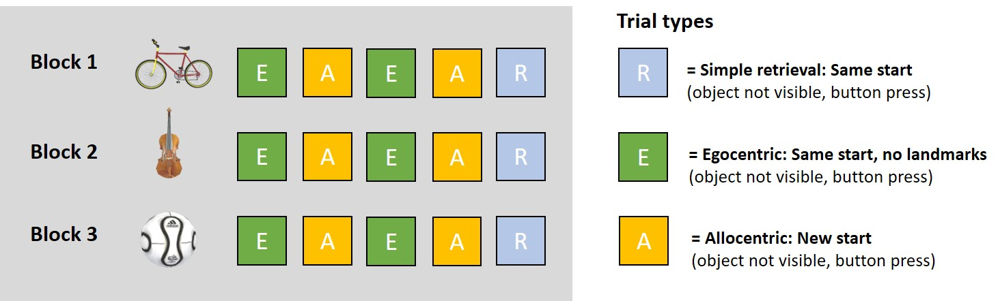
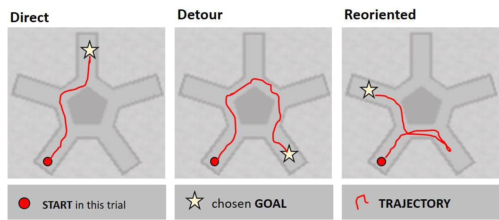

### Task

Navigating a star-shaped maze environment ("Starmaze") with three goal locations.

{width=450px}

### Sessions

**Day 1**

* Practise trials, including motor control (joystick, 2 trials) and task explanation (5 trials).
* Navigation to and remembering of the position of three goal locations. Baseline retrieval in egocentric (observer-dependent, i.e. from same starting point but without landmark cues) and allocentric (observer-independent, i.e. from new starting points) navigation condition (15 trials per goal location, 45 trials in total).

**Day 14**

* Consolidated retrieval in egocentric and allocentric navigation condition (5 trials per goal location, 15 trials in total).
* Non-navigational memory retrieval: Recognitve maze shape, recognize landmarks and goal objects, reconstruct location of landmarks and goal object (4 trials).


{width=500px}

{width=500px}

{width=500px}


```{r setup, include = FALSE, cache=FALSE}

library(tidyverse)
library(cowplot)
library(kableExtra)
source("R_rainclouds.R") # requires plyr package
# install.packages('tinytex')
# tinytex::install_tinytex() # latex for pdf file creation

knitr::read_chunk('Script_02_Table_Plot_Creator.R')
```


```{r, load_data, include=FALSE}
in_file <- "../WP10_data/WP10_results/WP10_results_table.RData"
load(in_file)
rm(in_file)
```


### Sample
Cross-sectional comparison between

* **Young kids** (6-7 yrs, n = `r length(unique(sm_trial_data$id[sm_trial_data$group=="YoungKids"]))`) 
* **Older kids** (9-10 yrs, n = `r length(unique(sm_trial_data$id[sm_trial_data$group=="OldKids"]))`)
* **Young adults** (18-35 yrs, n = `r length(unique(sm_trial_data$id[sm_trial_data$group=="YoungAdults"]))`)
* **Older adults** (68-75 yrs, n = `r length(unique(sm_trial_data$id[sm_trial_data$group=="OldAdults"]))`)


### How long did the sessions take?

**Young kids**: 

* Day 1: 5 min for practise, 22 min for learning = 27 min total
* Day 14: 7 min for retrieval, 3 min for non-navigational tests = 10 min total

**Older kids**: 

* Day 1: On average `r mean(5, 6, 5, 6, 4, 5, 6, 5)` min for practise (range: `r range(5, 6, 5, 6, 4, 5, 6, 5)`), `r mean(18, 15, 17, 29, 18, 21, 25, 22)` min for learning (range: `r range(18, 15, 17, 29, 18, 21, 25, 22)`) = `r mean(18, 15, 17, 29, 18, 21, 25, 22) + mean(5, 6, 5, 6, 4, 5, 6, 5)` min total (range: `r range(18+5, 15+6, 17+5, 29+6, 18+4, 21+5, 25+6, 22+5)`)
* Day 14: On average `r mean(7, 5, 5, 4, 4, 5, 8, 7, 8)` min for retrieval (range: `r range(7, 5, 5, 4, 4, 5, 8, 7, 8)`), 3 min for non-navigational tests = `r mean(7, 5, 5, 4, 4, 5, 8, 7, 8) +  3` min total (range: `r range(7+3, 5+3, 5+3, 4+3, 4+3, 5+3, 8+3, 7+3, 8+3)`)


### Variables of interest

In learning trials, the goal is visible, i.e. is always found except if the participants needs more than 120 seconds (time out). In egocentric and allocentric retrieval trials, the goal is not visible. Participants go to the place where they remember the goal being located and press a button. 

* **Success** (yes/no): Finding the correct goal location. The criterion for success is being away less than 0.1 virtual units (vu, ~ approx. being in the correct alley).
* **Direct path** (yes/no): Being successful and additionally taking the shortest path without entering any additional alleys.
* **Final distance** (metric): Distance between x-/y-coordinates of the chosen and the correct goal location in virtual units (vu). 
$$FD = \sqrt{(x_{goal}-x_{chosen})^2 + (y_{goal}-y_{chosen})^2}$$
* **Path** (metric): Absolute length of traveled path to chosen goal location in virtual units (vu). Plots include only successful trials. Calculated as summation of distance between x-/y-coordinates over time. 
$$P = \sum \sqrt{(x_{t}-x_{t+1})^2 + (y_{t}-y_{t+1})^2}$$
* **Deviation to ideal path** (metric): Alternative to path (currently not used). Calculated as absolute percentage deviation of chosen path to ideal path. In contrast to **Path** this measure corrects rewarding short paths to incorrect goals. 
$$PD =abs((P - P_{ideal})/P_{ideal})*100)$$
* **Strategy classification**: direct strategy to chosen goal (no detours), central focus (circling in inner pentagon), reorientation (going back same path), serial, random or unclassified strategy. 


### Plots 
``` {r, plot_settings, include=FALSE}
```


#### Memory encoding: Learning curves at Day 1 \

How well did the three age groups learn the position of the three goal locations at Day 1? Young adults show a very good performance (at ceiling) after only a few trials. Old kids perform slightly worse. Even though they are able to find the correct goal location in most cases (high rate of success), they do not seem to take the most direct path and have more difficulties when determining the precise location of the goals. As expected, young kids perform even worse (caution: 1 subject only). Learning curves are averaged across blocks, i.e. across the three goal locations. 

``` {r, data_func_trial_wise, include=FALSE}
```

``` {r, trial_wise, echo=FALSE, fig.asp=1.75, fig.align = "center"}

plot_grid(pt1, pt2, pt3, pt4, ncol=1, labels="AUTO", rel_heights=c(1.1, 0.95, 0.95, 0.95))

```


#### Immediate and consolidated retrieval: Mean values in egocentric and allocentric condition \

There is a similar age-related peformance trajectory, i.e. a better performance in older subjects, in allocentric and egocentric trials during both immediate retrieval at Day 1 and consolidated retrieval at Day 14. Notably, performance variability seems to be higher in old kids comapred to young adults, some kids perform like adults whereas others struggle a lot. 

``` {r, data_func_agg, include=FALSE}
```

``` {r, aggregate_bars, echo=FALSE, warning=FALSE, fig.asp=2, fig.align = "center"}

plot_grid(pagg1, paggd1, pagg2, paggd2, pagg3, paggd3, pagg4, paggd4, ncol=2, rel_widths=c(1.75,1.25))

```

TBD: ADD DIRECT ALLO-EGO COMPARISON 


#### Strategy use data \

We categorized participant's trajectories into different strategies (still under development). At the moment, strategies are more of a qualitative description of the trajectory and independent of success. For example, direct strategy means that the participant went straight to the chosen goal location without any detours or returns, independent of whether that chosen goal location was correct or incorrect. 

Criteria for strategy assignment:

* Direct: No zones are re-entered (out of 20 zones: 5 peripheral alleys (outer half), 5 peripheral alleys (inner half), 5 inner alleys, 5 central triangles at intersections of peripheral and inner alleys). 
* Central focus: Either navigated more than half of the inner circle without re-entering zones OR re-entering zones and at least 60 % of trajectory spend in inner circle (includes full circle).
* Reoriented: Maximum of 3 peripheral alleys entered, plus re-entries in inner alleys and triangles (turning back).
* Serial: Minimum of 3 peripheral alleys entered, plus no re-entries in peripheral and inner alleys (no turning back).
* Random: Minimum of 4 peripheral alleys and 15 zones entered. 
* Unclassified for the rest.

{width=500px}


``` {r, data_func_strategy, include=FALSE}
```

``` {r, aggragate_strategy, echo=FALSE, fig.asp=2, fig.align = "center"}

plot_grid(ps1, psa, pse, ncol=1, labels="AUTO", rel_heights=c(1, 1, 1))

```

### Table with descriptive mean values \

TBD: MAKE THEM LOOK BETTER AND CORRECT PATH VALUE 

``` {r, table_setup, echo=FALSE, message=FALSE }

table_dat <- sm_trial_data %>% 
  group_by(group, session, trial_condition)  %>%
  summarise(success=mean(success),
            direct_path=mean(direct_path),
            final_distance=mean(final_distance_to_goal_abs),
            path=mean(path_abs))

```

``` {r, table_learn, echo=FALSE, message=FALSE, result="asis" }

table_dat  %>%
  filter(trial_condition=="main_learn")  %>% 
  select(group, success, direct_path, final_distance, path) %>%
  arrange(group) %>% 
  kbl(caption = "Mean values for learning trials",
      col.names = c("Session", "Group", "Success", "Direct path", "Final distance", "Path"),
      digits = 2) %>% 
  kable_classic(html_font = "Latin Modern") %>% 
  row_spec(0, bold=T) %>%
  add_header_above(bold=T, c(" " = 2, "Variables" = 4))

```
\
\
``` {r, table_alloego, echo=FALSE, message=FALSE, result="asis" }

table_dat  %>%
  filter((trial_condition=="ego_ret" | trial_condition=="allo_ret"))  %>% 
  select(trial_condition, session, group, success, direct_path, final_distance, path) %>%
  arrange(trial_condition, session, group) %>% 
  kbl(caption = "Mean values for allocentric and egocentric trials", 
      col.names = c("Type", "Session", "Group", "Success", "Direct path", "Final distance", "Path"),
      digits = 2)%>% 
  kable_classic(html_font = "Latin Modern") %>% 
  row_spec(0, bold=T) %>% 
  collapse_rows(columns = 1:3, valign = "top") %>%
  add_header_above(bold=T, c(" " = 3, "Variables" = 4))

```
